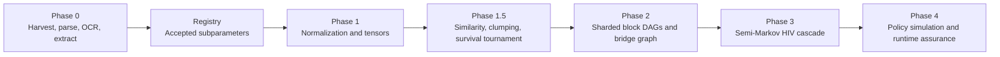
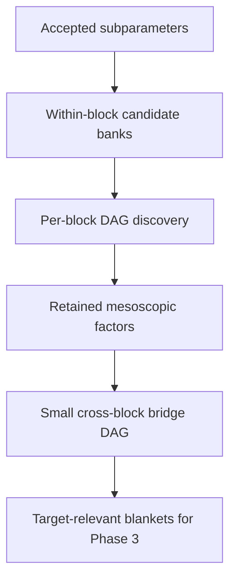
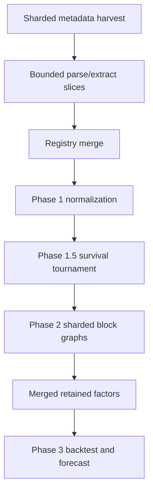

# ModelHIV-PH

ModelHIV-PH is a staged HIV evidence-mining, causal-structure, and semi-Markov cascade modeling platform focused on the Philippines.

The system is designed to do three things safely:

1. turn literature and official records into structured subparameters
2. reduce those subparameters into smaller, auditable factor sets
3. use the retained factors to forecast the HIV cascade and compare against reference series such as HARP and official anchors

This repo is intentionally built as a pipeline rather than one giant model. That keeps the system inspectable, easier to debug, and safer to run on a single Windows laptop with bounded RAM and an 8 GB GPU.

## What The Repo Does

At a high level, the repository:

- harvests literature and official data from broad source families
- parses metadata, PDFs, OCR text, and chunked document spans
- extracts candidate subparameters with provenance, geography, time, and typed payloads
- normalizes those candidates into Province x Month x Feature tensors
- clusters similar signals into mesoscopic factors
- learns a sparse, exact-acyclic DAG over retained factors
- feeds the retained factor sets into a hierarchical semi-Markov HIV cascade model
- backtests that model against frozen historical reference trajectories
- emits policy-facing outputs downstream

## Architecture



## Why The Pipeline Is Split

The repository is not trying to learn one giant graph over every mined variable at once.

Instead, it uses a layered graph strategy:



This is deliberate.

- It keeps memory use bounded.
- It avoids forcing unrelated variables into one dense graph.
- It makes the causal structure easier to audit.
- It reduces the chance of a huge unstable adjacency matrix blowing up the run.

## Repository Layout

- `src/epigraph_ph/core`
  Shared contracts, disease-plugin interfaces, province archetypes, and runtime assurance support.
- `src/epigraph_ph/plugins/hiv.py`
  The HIV plugin. This is the domain rulebook for the repo.
- `src/epigraph_ph/adapters/structured_sources.py`
  First-class structured adapters for official and literature source families.
- `src/epigraph_ph/phase0`
  Harvest, parse, OCR, extract, boundary validation, and support artifacts.
- `src/epigraph_ph/registry`
  Source and subparameter registry builders.
- `src/epigraph_ph/phase1`
  Measurement normalization and tensor construction.
- `src/epigraph_ph/phase15`
  Similarity graphs, mesoscopic factor construction, survival tournament, and Bayesian tuning on top of the tournament.
- `src/epigraph_ph/phase2`
  Sharded block-graph builder, exact DAG projection, bootstrap/permutation diagnostics, and retained blankets.
- `src/epigraph_ph/phase3`
  Hierarchical semi-Markov HIV cascade inference, frozen backtests, and representation tournaments.
- `src/epigraph_ph/phase4`
  Policy evaluation and runtime assurance outputs.
- `tests`
  Contract, math, artifact, and regression coverage.
- `scripts`
  Local helpers including OCR serving, WSL bootstrap, and probes.
- `artifacts`
  Run outputs and analysis products.

## The HIV Plugin

The HIV plugin in [D:\EpiGraph_PH\src\epigraph_ph\plugins\hiv.py](/D:/EpiGraph_PH/src/epigraph_ph/plugins/hiv.py) declares the core modeling contract:

- determinant silos
- query banks
- source adapters
- Phase 0 boundary rules
- Phase 1 normalization rules
- Phase 1.5 tournament and Bayesian search ranges
- Phase 2 graph constraints
- Phase 3 priors and frozen-backtest tournament settings
- Phase 4 policy settings
- gold-standard checks for each phase

In plain English, the plugin is where the repo says:

"For HIV in the Philippines, these are the kinds of evidence, states, priors, constraints, and outputs we accept."

## Phase 0: Harvest, Parse, OCR, Extract

Main modules:

- [D:\EpiGraph_PH\src\epigraph_ph\phase0\pipeline.py](/D:/EpiGraph_PH/src/epigraph_ph/phase0/pipeline.py)
- [D:\EpiGraph_PH\src\epigraph_ph\phase0\boundary_models.py](/D:/EpiGraph_PH/src/epigraph_ph/phase0/boundary_models.py)
- [D:\EpiGraph_PH\src\epigraph_ph\phase0\literature_candidates.py](/D:/EpiGraph_PH/src/epigraph_ph/phase0/literature_candidates.py)
- [D:\EpiGraph_PH\src\epigraph_ph\phase0\semantic_benchmark.py](/D:/EpiGraph_PH/src/epigraph_ph/phase0/semantic_benchmark.py)
- [D:\EpiGraph_PH\src\epigraph_ph\phase0\shard_materializer.py](/D:/EpiGraph_PH/src/epigraph_ph/phase0/shard_materializer.py)

### What Phase 0 does

Phase 0 is the evidence factory.

It:

- harvests source metadata from official and literature platforms
- snapshots remote PDFs and pages when budget allows
- parses born-digital PDFs and metadata docs
- optionally runs GPU-backed OCR for hard documents
- extracts numeric observations and soft text-derived candidates
- validates extracted candidates through strict boundary models
- writes accepted and rejected outputs separately
- builds family-specific candidate banks
- writes alignment tensors and retrieval artifacts

### Structured source families

The current source stack includes:

- WHO
- UNAIDS
- DOH Philippines
- UN
- NDHS
- YAFS
- FIES
- PhilGIS / PSGC
- PhilHealth
- Google Mobility
- World Bank WDI
- DOH facility statistics
- transport proxies
- PubMed
- arXiv
- bioRxiv
- OpenAlex
- Crossref
- Semantic Scholar

### The evolving Phase 0 boundary

Phase 0 does not use one giant flat schema anymore.

It uses:

- one stable outer envelope
- multiple family-specific payloads
- multiple JSON outputs instead of one monolith

The stable envelope contains:

- provenance
- geo binding
- time binding
- confidence
- extraction mode
- evidence references
- signal family

The current family payloads are:

- `PopulationMeasure`
- `LogisticsAccess`
- `BehaviorSignal`
- `ServiceCapacity`
- `EconomicConstraint`
- `PolicyEnvironment`
- `CascadeObservation`

This design matters because the ontology is intentionally soft.

We want Phase 0 to expand subparameters aggressively, but we still need typed structure at the boundary so later phases can reason over the rows safely.

### Phase 0 outputs

Phase 0 writes split outputs such as:

- accepted candidates
- rejected candidates
- boundary validation summary
- family-specific candidate banks
- alignment tensors
- schema summaries
- literature review reports
- curated bibliography
- review queues
- tool stack and resource manifests

### Phase 0 acceptance policy

The current acceptance logic is designed to stay soft without becoming sloppy.

It keeps:

- validity checks
- support checks
- leakage prevention
- finite-value checks
- shape checks

It now also does better geo binding for literature candidates by using:

- explicit geo fields
- geo mentions
- literature titles
- source title context
- `query_geo_focus`

And it uses softer acceptance for well-supported text signals by recognizing:

- typed signal families
- evidence-rich titles and excerpts
- literature references
- soft ontology tags
- linkage targets
- text-supported prior signals even when the row is not a direct official anchor

## Registry

Main module:

- [D:\EpiGraph_PH\src\epigraph_ph\registry\subparameters.py](/D:/EpiGraph_PH/src/epigraph_ph/registry/subparameters.py)

The registry stage is the bridge between extraction and modeling.

It combines:

- accepted Phase 0 candidates
- wide-sweep literature bank rows
- determinant silo context

into one explicit subparameter registry.

This matters because Phase 1 reads the registry.

The code now also falls back safely to accepted Phase 0 candidates if the registry is missing or empty, so a manual run cannot silently collapse to zero normalized rows just because the registry command was skipped.

## Phase 1: Measurement Normalization

Main modules:

- [D:\EpiGraph_PH\src\epigraph_ph\phase1\pipeline.py](/D:/EpiGraph_PH/src/epigraph_ph/phase1/pipeline.py)
- [D:\EpiGraph_PH\src\epigraph_ph\phase1\normalization_helpers.py](/D:/EpiGraph_PH/src/epigraph_ph/phase1/normalization_helpers.py)

### What Phase 1 does

Phase 1 turns heterogeneous evidence into comparable model inputs.

It produces:

- `aligned_tensor`
- `standardized_tensor`
- `denominator_tensor`
- `missing_mask`
- `quality_weight_tensor`
- `normalized_subparameters.json`
- `parameter_catalog.json`

### Important plain-English terms

- `denominator tensor`
  A table of the population or reference bases needed to convert counts into comparable rates or shares. Without this, counts from large and small provinces get mixed unfairly.
- `missing mask`
  A yes-or-no table showing where data is actually missing. It stops the model from confusing missing with zero.
- `density conversion`
  Turning raw counts into relative quantities like per-capita or per-PLHIV values.
- `winsorization`
  Capping extreme outliers so a few broken values do not distort the whole scale.
- `log1p`
  A log transform that can handle zero values.
- `Box-Cox`
  Another way to reshape skewed data so it behaves more cleanly.
- `robust scaling`
  Scaling by statistics like the median and IQR instead of more outlier-sensitive choices.

### Why Phase 1 is necessary

Without Phase 1, the repo would be mixing:

- counts
- percentages
- rates
- capacities
- soft supports
- national rows
- subnational rows
- sparse and dense evidence

as if they were all the same kind of number.

They are not.

## Phase 1.5: Mesoscopic Factors And Survival Tournament

Main modules:

- [D:\EpiGraph_PH\src\epigraph_ph\phase15\pipeline.py](/D:/EpiGraph_PH/src/epigraph_ph/phase15/pipeline.py)
- [D:\EpiGraph_PH\src\epigraph_ph\phase15\graph_helpers.py](/D:/EpiGraph_PH/src/epigraph_ph/phase15/graph_helpers.py)
- [D:\EpiGraph_PH\src\epigraph_ph\phase15\bayesian_survival.py](/D:/EpiGraph_PH/src/epigraph_ph/phase15/bayesian_survival.py)

### What Phase 1.5 does

Phase 1.5 groups similar subparameters into broader factor surfaces.

It:

- computes similarity across accepted normalized rows
- clusters related signals
- builds mesoscopic factor surfaces
- builds network-style features
- runs a holdout-based survival tournament
- optionally tunes the tournament with Bayesian optimization on top of the same objective

### What changed conceptually

Phase 1.5 no longer uses subjective "scientific eligibility" language as the deciding rule.

The survival rule is now:

1. hard validity checks
2. tournament scoring on holdout performance
3. stability and sparsity penalties measured from resampling

So the decision rule is:

- if a factor helps out-of-sample prediction and remains stable, it survives
- if it does not, it dies

### Bayesian optimization in Phase 1.5

Bayesian optimization now tunes the survival tournament; it does not replace it.

The search space includes:

- tournament score weights
- survivor budgets per block
- representation mix preference across unclumped, clumped, and network factors

If the optimized tournament beats the baseline objective, the optimized pool becomes active. If not, the system keeps the baseline pool.

## Phase 2: Sharded Causal Structure Discovery

Main modules:

- [D:\EpiGraph_PH\src\epigraph_ph\phase2\pipeline.py](/D:/EpiGraph_PH/src/epigraph_ph/phase2/pipeline.py)
- [D:\EpiGraph_PH\src\epigraph_ph\phase2\block_graph_builder.py](/D:/EpiGraph_PH/src/epigraph_ph/phase2/block_graph_builder.py)
- [D:\EpiGraph_PH\src\epigraph_ph\phase2\shard_summary.py](/D:/EpiGraph_PH/src/epigraph_ph/phase2/shard_summary.py)
- [D:\EpiGraph_PH\src\epigraph_ph\phase2\rescue_profile.py](/D:/EpiGraph_PH/src/epigraph_ph/phase2/rescue_profile.py)

### What Phase 2 does

Phase 2 learns sparse causal structure over retained factors.

It does:

- mutual-information prefiltering
- bounded Fisher-Z PC-style pruning
- tier and lag masking
- NOTEARS-style DAG optimization
- exact DAG projection to remove cycles
- bootstrap edge stability
- permutation null benchmarking
- time-stratified validation
- collinearity reporting
- target blanket extraction for Phase 3

### Why not one giant graph?

Because one giant graph is a bad idea on this machine and a bad scientific structure for this problem.

Phase 2 now works shard-by-shard and block-by-block:

- per-block candidate banks
- per-block DAGs
- retained mesoscopic factors
- small bridge DAG
- Phase 3 target blankets only

This keeps the structure sparse and auditable.

## Phase 3: Hierarchical Semi-Markov HIV Cascade

Main modules:

- [D:\EpiGraph_PH\src\epigraph_ph\phase3\pipeline.py](/D:/EpiGraph_PH/src/epigraph_ph/phase3/pipeline.py)
- [D:\EpiGraph_PH\src\epigraph_ph\phase3\rescue_core.py](/D:/EpiGraph_PH/src/epigraph_ph/phase3/rescue_core.py)

### States

The model uses explicit HIV cascade states:

- `U` undiagnosed
- `D` diagnosed
- `A` on ART
- `V` virally suppressed / documented suppression
- `L` lost or disengaged from care

### What Phase 3 does

Phase 3:

- builds observation ladders from official and HARP-aligned sources
- uses retained determinants from Phase 2
- fits a hierarchical semi-Markov cascade model
- allows province, region, and national structure
- supports interventions and covariate modifiers
- runs frozen-history backtests
- compares against simple baselines
- runs a representation tournament over unclumped, clumped, and hybrid determinant sets

### Representation tournament

The repo now compares multiple determinant representations on the same frozen HARP backtest:

- `unclumped`
- `clumped_baseline`
- `clumped_optimized`
- `hybrid_baseline`
- `hybrid_optimized`

That lets the pipeline ask a concrete question:

"Does the optimized survivor set that won in Phase 1.5 also improve actual cascade backtest error?"

### Inference engines

Phase 3 supports multiple inference paths:

- Torch MAP
- JAX SVI
- JAX NUTS

WSL2 GPU interop is now supported for true Torch-CUDA to JAX-GPU DLPack handoff on machines where the Linux environment is provisioned correctly.

## Phase 4: Policy Layer

Main modules:

- [D:\EpiGraph_PH\src\epigraph_ph\phase4\pipeline.py](/D:/EpiGraph_PH/src/epigraph_ph/phase4/pipeline.py)
- [D:\EpiGraph_PH\src\epigraph_ph\phase4\policy_analysis.py](/D:/EpiGraph_PH/src/epigraph_ph/phase4/policy_analysis.py)

Phase 4 takes the cascade outputs and turns them into policy comparisons and sensitivity outputs.

This is the action layer, not the disease-dynamics layer.

## Large-Corpus Strategy

The repo does not try to parse or graph 100,000 papers in one pass.

The safe production strategy is:



### Why this matters

- RAM is tighter than disk on the laptop.
- OCR is expensive even with GPU support.
- Exact DAG discovery should happen on retained factor sets, not giant raw candidate pools.
- The bridge graph should stay small by design.

## Typical Commands

### Install and test

```powershell
python -m pip install -e .[core]
python -m pytest tests -q
python -m epigraph_ph.cli.main --help
```

### Bounded end-to-end run

```powershell
python -m epigraph_ph.cli.main phase0 build --run-id demo-bounded --plugin hiv --corpus-mode massive --target-records 500 --working-set-size 150
python -m epigraph_ph.cli.main registry build --run-id demo-bounded --plugin hiv
python -m epigraph_ph.cli.main phase1 build --run-id demo-bounded --plugin hiv --profile hiv_rescue_v2
python -m epigraph_ph.cli.main phase15 build --run-id demo-bounded --plugin hiv --profile hiv_rescue_v2
python -m epigraph_ph.cli.main phase2 build --run-id demo-bounded --plugin hiv --profile hiv_rescue_v2
python -m epigraph_ph.cli.main phase3 tournament-frozen-backtest --run-id demo-bounded --plugin hiv --profile hiv_rescue_v2 --phase3-inference torch_map
```

### Metadata-first large harvest

```powershell
python -m epigraph_ph.cli.main phase0 harvest --run-id prod-harvest-s00 --plugin hiv --corpus-mode massive --target-records 100000 --metadata-only --query-shard-count 12 --query-shard-index 0
```

Repeat across shard indices, merge the shard manifests, then parse bounded slices instead of trying to parse the full merged corpus in one shot.

## What To Look At In Artifacts

Typical high-value artifacts are:

- `phase0/extracted/boundary_validation_report.json`
- `phase0/extracted/family_candidate_banks_manifest.json`
- `phase1/normalization_report.json`
- `phase15/factor_survival_tournament.json`
- `phase15/factor_survival_bayesian_optimization.json`
- `phase2/feature_matrix_mix_report.json`
- `phase2/dag_projection_report.json`
- `phase2/phase3_target_blankets.json`
- `phase3_frozen_backtest_tournament/representation_tournament.json`

## Current Practical Constraints

The repo is strongest on:

- staged validation
- provenance
- graph sparsity discipline
- bounded computation
- frozen-history backtesting

The repo is weaker on:

- Phase 0 extraction precision on broad literature
- geo binding on generic international papers
- very large live OCR budgets
- making JAX/NUTS robust enough to be the default inference path

## Current Design Commitments

The current design deliberately prefers:

- soft ontology at extraction
- strict typed boundaries at phase transitions
- smaller graphs instead of one giant graph
- measurable tournaments instead of handwavy promotion rules
- backtests over intuition

## Quick Mental Model

If you want the shortest plain-English summary:

- Phase 0 finds possible signals.
- Registry keeps the candidate bank explicit.
- Phase 1 puts the numbers on a comparable scale.
- Phase 1.5 asks which clumps survive a holdout tournament.
- Phase 2 learns a sparse graph over the survivors.
- Phase 3 uses those survivors to simulate the HIV cascade.
- Phase 4 compares decisions on top of that cascade.

That is the current system.
