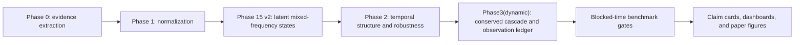

# ModelHIV-PH

ModelHIV-PH is a staged scientific system for building, falsifying, and improving HIV epidemic models for the Philippines. The project combines evidence extraction, mixed-frequency observation contracts, latent determinant structure, and blocked-time cascade forecasting.

The current scientific goal is not to claim that one model already beats all official systems. The current goal is narrower and more defensible:

- build a citation-grade evidence and observation ledger from HARP, HASP, HIV_Data, official data, and literature-derived determinants
- learn determinant structure in Phase 2 only after source-family robustness checks
- build a Phase 3 model that is conserved, support-aware, and evaluated against carry-forward, frozen R10 readouts, and official-style annual references
- report "not identifiable" or "claim blocked" when sparse evidence cannot support a stronger process claim

This repository is research software. It is not a clinical tool, not an official DOH/UNAIDS/Spectrum/AEM replacement, and not a decision system without external review.

## Current Status

The canonical current modelling branch is:

```text
Phase15 v2 -> Phase2 structural payload -> Phase3(dynamic)
```

The historical root `src/epigraph_ph/phase3` tree is still useful for older TR-V3/R10 experiments and paper lineage, but new scientific claims should be made from:

```text
src/epigraph_ph/Phase3(dynamic)
```

The latest checked-in Phase3(dynamic) branch is `R12-09`, a stock-cone-safe annual trajectory head. It fixes one specific blocker: annual-anchor diagnosed/ART trajectory behaviour at 3-year and 5-year horizons, while preserving the full stock cone and conditional VL/suppression gates.

Latest R12-09 result, run `p3d-r12-stock-cone-annual-trajectory-20260430-s03`:

| Gate | Result |
| --- | --- |
| Full blocked carry-forward gate | Pass |
| Full stock cone | Pass |
| Conditional VL/suppression rates | Pass |
| Annual-anchor trajectory vs matched R10 | Pass at 3y and 5y |
| Full mixed-lineage R10 trajectory | Still fails at 3y and 5y |
| Full-cascade champion | Not promoted |

Key scores from the latest R12-09 report:

| Horizon | Candidate full MAE | Carry-forward full MAE | Candidate R10-scope MAE | Matched R10 MAE | Status |
| --- | ---: | ---: | ---: | ---: | --- |
| 1y | 0.2226 | 0.2870 | 0.0851 | 0.0953 | beats carry and R10 |
| 3y | 0.3016 | 0.5279 | 0.1531 | 0.1157 | beats carry, fails full R10 |
| 5y | 0.5512 | 0.8388 | 0.2388 | 0.1294 | beats carry, fails full R10 |

Annual-anchor route scores:

| Route | Horizon | Candidate | Carry-forward | Matched R10 | Status |
| --- | ---: | ---: | ---: | ---: | --- |
| slide annual anchor | 3y | 0.0434 | 0.2729 | 0.1157 | pass |
| slide annual anchor | 5y | 0.0434 | 0.2729 | 0.1294 | pass |

Interpretation: R12-09 is scientifically useful because it separates annual-anchor trajectory evidence from short-horizon program nowcasting evidence. It is not yet a final model because the full mixed-lineage trajectory still loses to R10 at longer horizons.

## Repository Map

```text
src/epigraph_ph/plugins/hiv.py
    HIV domain contract: latent blocks, accepted evidence families, transition priors, and phase settings.

src/epigraph_ph/harp_archive
    HARP/HASP/HIV_Data ingestion, WDI/WHO/UNAIDS-style imports, official cascade anchors, and monthly/annual support data.

src/epigraph_ph/aidsdatahub
    AIDS Data Hub extraction helpers.

src/epigraph_ph/phase0
    Evidence extraction, citation ledgers, determinant bridges, and Phase 3 target contracts.

src/epigraph_ph/phase1
    Normalization and tensor construction.

src/epigraph_ph/phase15
    Mixed-frequency hierarchical latent state estimation and reconciled factor rows.

src/epigraph_ph/phase2
    Direct temporal surfaces, hidden low-rank structure, multiscale support, determinant robustness, and source-family falsification.

src/epigraph_ph/phase3
    Historical TR-V2/TR-V3 frontier, R10 family, strict diagnosis-kernel work, HMBA experiments, and expanded-HARP falsification lineage.

src/epigraph_ph/Phase3(dynamic)
    Current canonical Phase 3 dynamics package: observation ledger, revision program, monthly shock work, incidence/diagnosis repair, R11/R12 sparse state-space gates, and latest benchmark reports.

tests
    Contract, extraction, graph, Phase 3 dynamics, and experiment-regression tests.

docs
    Scientific audits, source probes, extracted PDFs/text, HARP/HASP/PhilHealth/PSA support, and phase planning notes.
```

## Architecture


```mermaid
flowchart LR
    A["Phase 0: evidence extraction"] --> B["Phase 1: normalization"]
    B --> C["Phase 15 v2: latent mixed-frequency states"]
    C --> D["Phase 2: temporal structure and robustness"]
    D --> E["Phase3(dynamic): conserved cascade and observation ledger"]
    E --> F["Blocked-time benchmark gates"]
    F --> G["Claim cards, dashboards, and paper figures"]
```

## Evidence Universe

The current evidence universe includes direct observations, auxiliary likelihood rows, validation-only annual estimates, determinant covariates, and quarantined rows. The important principle is that the model is not allowed to treat all rows as the same kind of truth.

Current source families include:

- DOH HARP/HASP reports and surveillance archives
- expanded `HIV_Data` CSV/PDF exports, including key population and treatment cascade files
- UNAIDS/AIDS Data Hub style annual incidence, deaths, PLHIV, and cascade series
- World Bank WDI population and HIV indicator support
- WHO mortality database support
- PhilHealth annual reports and portal statistics
- PSA, FIES, YAFS, poverty, demographic, and regional support data
- scientific literature from PubMed/OpenAlex/Crossref-style pipelines

The current rule is strict:

- HARP diagnosis counts can train diagnosis/reporting processes.
- Annual incidence/deaths estimates are validation-only or weak auxiliary evidence unless an explicit measurement-error head is active.
- Phase 2 determinant edges are hypotheses or covariates, not validated causal mechanisms.
- Hidden Phase 2 modes are shared latent shocks, not intervention targets.

## Phase Timeline

### Phase 0, Evidence Extraction And Ledger

Purpose: turn literature, official PDFs, official CSVs, and extracted text into structured candidate evidence.

Implemented:

- structured numeric extraction from official and literature sources
- citation evidence ledgers
- determinant bridge code for official covariates
- soft ontology tags, expected signs, measurement roles, and observation operators
- HARP/HASP/HIV_Data, WDI, WHO mortality, PhilHealth, PSA/FIES/YAFS, and AIDS Data Hub ingestion support
- source-family aware candidate extraction

Important files:

- `src/epigraph_ph/phase0/pipeline.py`
- `src/epigraph_ph/phase0/citation_evidence_ledger.py`
- `src/epigraph_ph/phase0/official_determinant_bridge.py`
- `src/epigraph_ph/phase0/phase3_target_contract.py`
- `src/epigraph_ph/harp_archive/pipeline.py`
- `src/epigraph_ph/aidsdatahub/extractor.py`

Scientific status:

- Good for broad determinant discovery and structured support.
- Still requires citation-grade review before strong causal determinant claims.

### Phase 1, Normalization

Purpose: convert heterogeneous evidence into comparable tensors and row contracts.

Implemented:

- aligned tensors
- standardized tensors
- denominator tensors
- quality weights
- measurement-role propagation
- density and scale normalization
- support for direct-context vs observability splits

Important files:

- `src/epigraph_ph/phase1/pipeline.py`

Scientific status:

- Good enough as a bridge into Phase15 v2.
- Needs continued checks for support-partition leakage when new source families are added.

### Phase 15 v2, Latent Mixed-Frequency State Layer

Purpose: create latent national, regional, and provincial states from mixed-frequency evidence.

Implemented:

- mixed-frequency hierarchical latent states
- sparse observation operators
- context-only rows excluded from likelihood
- province, region, and national tensors
- reconciled factor rows

Important files:

- `src/epigraph_ph/phase15/pipeline.py`
- `src/epigraph_ph/phase15/v2_engine.py`

Scientific status:

- This is the active bridge between raw normalized evidence and Phase 2 structure.
- Legacy Phase15 block names can still appear in older artifacts, so current claims should use Phase15 v2 outputs.

### Phase 2, Temporal Structure And Determinant Robustness

Purpose: learn lagged determinant and latent-block structure without overclaiming causality.

Implemented:

- direct temporal surface over latent states
- hidden-driver low-rank surface
- hidden mode score tensor
- multiscale DAG support, explicitly support-only
- structural payloads for Phase 3
- compatibility payloads for older consumers
- source-family re-estimation ablation
- determinant robustness checks
- edge falsification scaffolds
- official augmented baseline inputs

Important files:

- `src/epigraph_ph/phase2/pipeline.py`
- `src/epigraph_ph/phase2/latent_temporal_graph.py`
- `src/epigraph_ph/phase2/structural_payload.py`
- `src/epigraph_ph/phase2/determinant_robustness.py`
- `src/epigraph_ph/phase2/edge_falsification.py`
- `src/epigraph_ph/phase2/source_reestimate_ablation.py`

Scientific status:

- Direct Phase 2 surfaces can be used as module-specific covariates after baseline models pass gates.
- Hidden modes remain sidecar latent shocks.
- Phase 2 edges should not be advertised as validated causal mechanisms until source ablation, time-window shift, placebo, and synthetic-recovery checks pass.

### Historical Root Phase 3, TR-V3 And R10 Lineage

Purpose: explore broad benchmark families, strict diagnosis kernels, hierarchical bundle search, and Phase 2 seeded model families.

Implemented experiment families include:

- strict spec-vs-code audits
- strict diagnosis-delay kernel work
- integrated autoresearch branches
- HMBA module-bundle search
- provincial and hierarchical diagnostics
- R10 current champion and R10-neighborhood experiments
- expanded-HARP compatibility failure tests
- phase2-seeded champion, sidecar, coverage, and admissibility batches
- GRASP-inspired and probabilistic trajectory audits

Important files:

- `src/epigraph_ph/phase3/frontier/integrated_autoresearch.py`
- `src/epigraph_ph/phase3/frontier/hierarchical_autoresearch.py`
- `src/epigraph_ph/phase3/frontier/strict_diagnosis_kernel_research.py`
- `src/epigraph_ph/phase3/tr_v3_experiment_suite.py`
- `src/epigraph_ph/phase3/tr_v3_current_champion_expanded_harp_compatibility_batch.py`
- `src/epigraph_ph/phase3/tr_v3_phase2_seeded_champion_batch.py`

Scientific conclusion:

- R10-like endpoint/readout families were a useful head start, but expanded HARP/HASP/HIV_Data falsified exact R10 as a mechanistic champion.
- R10 is now a benchmark/readout teacher, not a mechanistic truth model.

### Phase3(dynamic), Current Canonical Dynamics

Purpose: build a strict observation-ledger-driven HIV cascade model that can make claim-aware predictions without mixing incompatible evidence roles.

Implemented:

- `ObservationRoleLedger`
- allowed-use enforcement
- quarantine blocking
- REV-style observation/model contracts
- explicit population/inflow/incidence interfaces
- diagnosis-flow and incidence repair branches
- monthly shock and reporting nowcast branches
- decomposition-inspired trend/support-shift/shock controls
- back-half process states and conditional VL/suppression rate gates
- re-engagement sensitivity gates
- lifted residual anatomy against R10
- R11 sparse state-space benchmark family
- R12 route-aware and lineage-aware evaluation contracts

Important files:

- `src/epigraph_ph/Phase3(dynamic)/src/phase3_dynamic/observation_ledger.py`
- `src/epigraph_ph/Phase3(dynamic)/src/phase3_dynamic/revision_program.py`
- `src/epigraph_ph/Phase3(dynamic)/src/phase3_dynamic/r11_sparse_state_space.py`
- `src/epigraph_ph/Phase3(dynamic)/src/phase3_dynamic/diagnosis_incidence_repair.py`
- `src/epigraph_ph/Phase3(dynamic)/src/phase3_dynamic/monthly_shock.py`
- `src/epigraph_ph/Phase3(dynamic)/src/phase3_dynamic/backhalf_channels.py`

## R11 And R12 Experiment Timeline

The R11/R12 sequence is the current model-development spine.

### R11

R11 moved the project from loose endpoint tuning to claim-aware state-space evaluation.

Key branches:

- `R11-00`: benchmark lock
- `R11-01`: deterministic D/A/T/V reconciliation
- `R11-02`: support-weighted observation operator
- `R11-03`: stock-consistency gate
- `R11-04`: reporting-shift observation model
- `R11-05`: annual incidence weak-measurement head
- `R11-06`: local-level state filter
- `R11-07`: empirical-Bayes transition shrinkage
- `R11-08`: linkage lag kernel
- `R11-09`: support-partition calibration
- `R11-10`: COVID/rebound reporting latent
- `R11-11`: conditional VL/suppression rate model
- `R11-12`: determinant lockbox
- `R11-13`: R10 readout teacher
- `R11-14`: posterior predictive and rate-gated back-half readout
- `R11-15`: multi-horizon lifted readout gate
- `R11-16` to `R11-18`: constrained shape heads and horizon-adaptive selectors
- `R11-19` to `R11-20`: transition-process branches for D/A and era-stratified removal/reporting
- `R11-21` to `R11-28`: selectors, diagnosis-flow repair, support-era adjustment, ART-specific horizon selection, lagged diagnosis, and promoted multi-horizon weighted reference

Scientific conclusion:

- R11-28 became the R12 research reference because it preserved stock/rate consistency and beat carry-forward, but it still failed R10 at longer horizons.

### R12

R12 asks a sharper question: is the remaining failure model dynamics, mixed observation lineage, or route-specific evidence mismatch?

Key branches:

- `R12-00`: promoted R11-28 reference lock
- `R12-01`: long-horizon D/A stock-shape correction
- `R12-02`: D/A transition process split
- `R12-03`: D/A residual-source branch
- `R12-04`: source/support lineage evaluation ablation
- `R12-05`: lineage-stratified train/evaluate contract
- `R12-06`: DOH quarterly support adequacy adjudication
- `R12-07`: horizon-specific evidence router
- `R12-08`: route-aware two-head nowcast/trajectory candidate
- `R12-09`: stock-cone-safe annual trajectory head

Scientific conclusion:

- R12-09 supports a route-specific annual-anchor trajectory claim.
- R12-09 does not yet support a full-cascade long-horizon champion claim.

## Latest R12-09 Artifacts

The compact latest R12-09 run is checked in under:

```text
src/epigraph_ph/Phase3(dynamic)/artifacts/runs/p3d-r12-stock-cone-annual-trajectory-20260430-s03/analysis
```

High-value files:

- `r12_reference_branch_comparison.json`
- `r12_reference_branch_comparison.md`
- `r12_09_stock_cone_safe_annual_trajectory_candidate_report.json`
- `r12_09_stock_cone_safe_annual_trajectory_full_report.json`
- `r12_09_stock_cone_safe_annual_trajectory_dashboard.png`
- `r10_horizon_matched_replay_report.json`

The repository root `artifacts/` directory remains ignored because large Phase 0/Phase 1/Phase 15 replay artifacts can reach many gigabytes.

## How To Run

This repository is developed in Ubuntu paths. Use `bash`, `python3`, and Linux paths.

Install editable package:

```bash
python3 -m pip install -e .
```

Run core tests:

```bash
python3 -m pytest tests -q
```

Run the targeted current Phase3(dynamic) sparse-state test:

```bash
PYTHONPATH="src/epigraph_ph/Phase3(dynamic)/src:src" \
uvx --from pytest --with numpy \
pytest "src/epigraph_ph/Phase3(dynamic)/tests/test_r11_sparse_state_space.py"
```

Replay the latest R12 branch:

```bash
PYTHONPATH="src/epigraph_ph/Phase3(dynamic)/src:src" \
uvx --from numpy --with matplotlib \
python -m phase3_dynamic.cli r12-reference-branch \
  --run-id p3d-r12-stock-cone-annual-trajectory-local \
  --start-year 2010 \
  --end-year 2025 \
  --min-train-years 5
```

## What Is Strong Today

The project is currently strongest on:

- explicit evidence provenance
- observation-role enforcement
- support-partition aware evaluation
- source-family ablation scaffolds
- blocked-time gates
- carry-forward and R10-aware comparisons
- stock-cone and conditional-rate non-regression gates
- clear separation between direct Phase 2 covariates and hidden latent shocks

## What Is Still Weak

The project is not yet publishable as a superior all-purpose HIV forecast model because:

- full mixed-lineage 3y/5y R10 trajectory gates still fail
- true official AEM/Spectrum quarterly replay is not locked
- incidence remains weakly observed and should stay validation-only or weak-measurement unless measurement error is explicit
- province-level claims are still auxiliary unless stronger provincial truth support is added
- Phase 2 determinant edges are not yet source-stable enough for causal language
- ART interruption and re-engagement are not strongly observed without treatment-hub/cohort access

## Near-Term Scientific Roadmap

The next high-value scientific steps are:

1. Build an official annual challenge gate against AEM/Spectrum-like annual incidence, deaths, PLHIV, and cascade outputs with no target leakage.
2. Keep R12-09 as a route-specific annual-anchor candidate, not a full champion.
3. Repair the remaining full mixed-lineage R10 failure through a DOH monthly/quarterly program-nowcast state process, not another generic endpoint correction.
4. Promote Phase 2 determinants only after source-family re-estimation, time-window shift, placebo separation, and synthetic-recovery checks.
5. Convert the current nested `Phase3(dynamic)` package into a cleaner `phase3_dynamic` layout only after import paths and artifact locators are migrated.

## Plain-English Summary

The project started as a broad evidence-to-graph system. It then learned that endpoint-style R10 models can look strong on old support but do not survive expanded HARP/HASP/HIV_Data cleanly. The current system therefore uses stricter observation roles, lineages, and blocked gates.

As of R12-09, we can say:

- We have a strong route-specific annual-anchor trajectory repair.
- We beat carry-forward broadly under the current blocked contract.
- We preserve stock and conditional-rate gates.
- We still do not beat R10 globally at 3y/5y mixed-lineage trajectory shape.

That is the honest current frontier.
