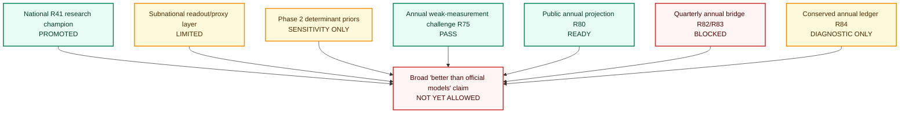
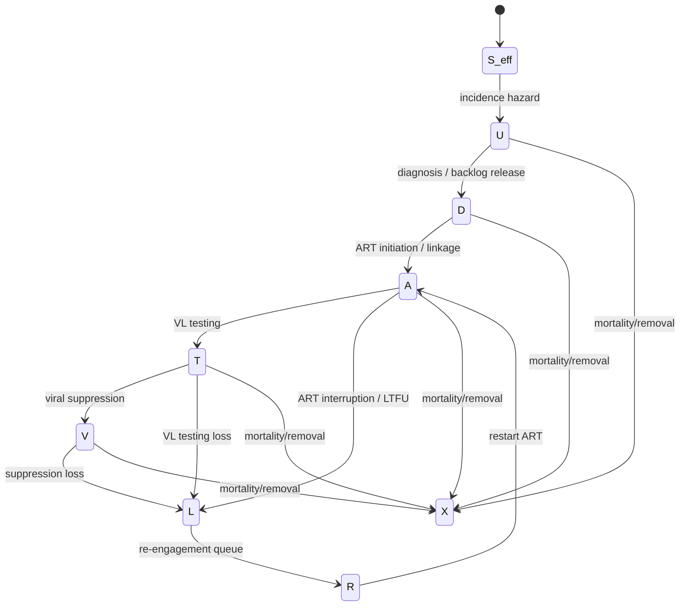
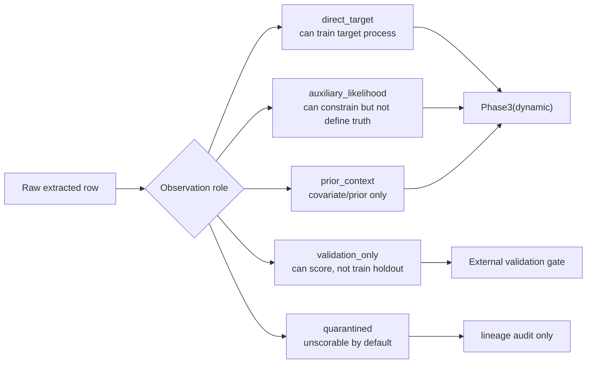
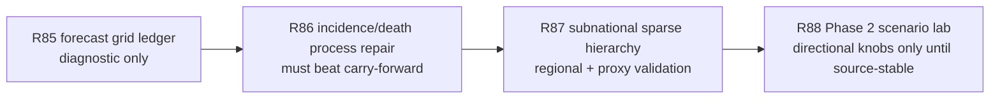

# ModelHIV-PH

> Evidence-ledger driven HIV epidemic modelling for the Philippines.
> The repository builds, falsifies, and tracks national/subnational HIV model families across evidence extraction, latent determinant graphs, and Phase 3 dynamic cascade forecasting.


This project is not a clinical tool, not an official DOH/UNAIDS/Spectrum/AEM replacement, and not a policy engine without external review. Its purpose is scientific: make every model claim traceable to data roles, blocked-time evaluation, failure anatomy, and explicit claim cards.

## Scientific Snapshot

| Layer | Current Status | What It Means |
| --- | --- | --- |
| National quarterly cascade | `R41` promoted as current national research champion | Useful readout/forecast champion under locked gates, not a final official-model replacement |
| Subnational modelling | readout/proxy champions exist, process claims limited | Regional claims remain constrained by sparse validation evidence |
| Annual public challenge | `R75` passes with weak-measurement annual heads | Annual incidence/deaths/PLHIV can be scored without holdout leakage, but this is not yet a quarterly mechanistic bridge |
| Public annual projection | `R80` ready | 2025-2035 public annual projection head exists as a separate annual track |
| Phase 2 determinant knobs | `R81` directional sensitivity only | Determinants can label scenarios, not provide numeric intervention effects |
| Quarterly-to-annual bridge | `R82/R83` blocked; `R84/R85` diagnostic only | The quarterly model now exposes complete conserved ledger quantities on a forecast grid, but it still does not beat carry-forward on annual public targets |

### Latest R84/R85 Verdict

`R84` added a conserved quarterly annual ledger to the dynamic simulator. `R85` then repaired the annual support coverage by forcing every holdout year to emit Q1-Q4 ledger quantities on an unscored forecast grid:

```text
S_eff -> incident_infections_period -> U
state-specific mortality/removal -> aids_deaths_period
U + D + A + T + V + L + R -> estimated_plhiv
```

| Annual Target | R85 Scored / Target Entries | R85 Candidate Mean Error | Carry-Forward Mean Error | Verdict |
| --- | ---: | ---: | ---: | --- |
| annual new infections | 28 / 28 | 0.4558 | 0.3116 | complete but weaker |
| annual AIDS deaths | 28 / 28 | 1.3640 | 0.4764 | complete but much weaker |
| estimated PLHIV | 28 / 28 | 0.1048 | 0.3818 | improves over carry-forward |
| all annual targets | 84 / 84 | 0.6415 | 0.3900 | diagnostic only |

Interpretation: the conserved state ledger is now visible and complete. That is necessary but not sufficient. PLHIV stock is promising; incidence and AIDS-death processes are the blocker and need stronger evidence-backed transition/mortality structure before annual mechanistic claims are publishable.

## Figure 1: System Architecture


```mermaid
flowchart LR
    P0["Phase 0<br/>evidence extraction<br/>papers, PDFs, HARP/HASP, WDI, WHO, PSA"] --> P1["Phase 1<br/>normalization<br/>roles, units, tensors"]
    P1 --> P15["Phase 15 v2<br/>mixed-frequency latent states<br/>national/region/province"]
    P15 --> P2["Phase 2<br/>lagged determinant graph<br/>direct surfaces + hidden modes"]
    P2 --> P3["Phase3(dynamic)<br/>observation ledger + cascade dynamics"]
    P3 --> G["Blocked-time gates<br/>carry-forward, R10, annual public targets"]
    G --> C["Claim registry<br/>promote / diagnostic / blocked"]

    classDef phase fill:#eaf4ff,stroke:#1864ab,stroke-width:1px,color:#0b2545;
    classDef gate fill:#fff4db,stroke:#b26b00,stroke-width:1px,color:#3b2500;
    classDef claim fill:#eafaf1,stroke:#1b7f45,stroke-width:1px,color:#083b1f;
    class P0,P1,P15,P2,P3 phase;
    class G gate;
    class C claim;
```

## Figure 2: Current Claim Board


```mermaid
flowchart TB
    A["National R41 research champion<br/>PROMOTED"]:::pass
    B["Subnational readout/proxy layer<br/>LIMITED"]:::warn
    C["Phase 2 determinant priors<br/>SENSITIVITY ONLY"]:::warn
    D["Annual weak-measurement challenge R75<br/>PASS"]:::pass
    E["Public annual projection R80<br/>READY"]:::pass
    F["Quarterly annual bridge R82/R83<br/>BLOCKED"]:::fail
    G["Conserved annual ledger R84<br/>DIAGNOSTIC ONLY"]:::warn
    H["Broad 'better than official models' claim<br/>NOT YET ALLOWED"]:::fail

    A --> H
    B --> H
    C --> H
    D --> H
    E --> H
    F --> H
    G --> H

    classDef pass fill:#e6fcf5,stroke:#087f5b,stroke-width:2px,color:#063b2c;
    classDef warn fill:#fff9db,stroke:#f08c00,stroke-width:2px,color:#4a2a00;
    classDef fail fill:#fff5f5,stroke:#c92a2a,stroke-width:2px,color:#4d0000;
```

## Figure 3: Cascade State Model


```mermaid
stateDiagram-v2
    [*] --> S_eff
    S_eff --> U: incidence hazard
    U --> D: diagnosis / backlog release
    D --> A: ART initiation / linkage
    A --> T: VL testing
    T --> V: viral suppression
    A --> L: ART interruption / LTFU
    T --> L: VL testing loss
    V --> L: suppression loss
    L --> R: re-engagement queue
    R --> A: restart ART
    U --> X: mortality/removal
    D --> X: mortality/removal
    A --> X: mortality/removal
    T --> X: mortality/removal
    V --> X: mortality/removal
```

State variables:

| Symbol | Meaning |
| --- | --- |
| `S_eff` | effective population denominator available for new infections |
| `U` | living with HIV, undiagnosed |
| `D` | diagnosed, not on ART |
| `A` | active ART without recent VL evidence |
| `T` | VL-tested but not suppressed |
| `V` | virally suppressed |
| `L` | interrupted or lost from active pathway |
| `R` | re-engaged/restart pathway |
| `X` | removal, including mortality where supported |

## Figure 4: Evidence Role Contract


```mermaid
flowchart LR
    Raw["Raw extracted row"] --> Role{"Observation role"}
    Role --> Direct["direct_target<br/>can train target process"]
    Role --> Aux["auxiliary_likelihood<br/>can constrain but not define truth"]
    Role --> Val["validation_only<br/>can score, not train holdout"]
    Role --> Prior["prior_context<br/>covariate/prior only"]
    Role --> Q["quarantined<br/>unscorable by default"]

    Direct --> Model["Phase3(dynamic)"]
    Aux --> Model
    Prior --> Model
    Val --> Gate["External validation gate"]
    Q --> Audit["lineage audit only"]
```

The model is intentionally strict: diagnosis counts, annual incidence estimates, ART stocks, VL testing rows, determinants, and hidden modes are not interchangeable.

## Experiment Timeline

| Phase / Run | Main Question | Outcome |
| --- | --- | --- |
| Phase 0 | Can we extract structured HIV determinants and official support rows? | Yes: HARP/HASP/HIV_Data, WDI, WHO, PSA/FIES/YAFS, PhilHealth, UNAIDS-style support, literature rows |
| Phase 1 | Can heterogeneous evidence become comparable tensors? | Yes: normalized tensors, roles, units, quality weights |
| Phase 15 v2 | Can mixed-frequency evidence produce latent national/regional/provincial states? | Yes: active bridge into Phase 2 |
| Phase 2 | Can lagged determinants and hidden modes be learned robustly? | Partly: useful structural payload, but determinants remain sensitivity-only |
| TR-V3 / R10 | Can broad endpoint/readout families beat naive baselines? | Yes in old evidence universe; failed under expanded HARP/HASP support |
| R11 | Can stock-consistency and trajectory gates stabilize quarterly cascade predictions? | Partly: R11-28 became locked research reference |
| R12 | Can annual anchors and DOH program routes be separated? | Yes: route-aware evidence split clarified failure sources |
| R13-R41 | Can national readout champions survive stricter gates? | R41 promoted as current national research champion |
| R75 | Can annual public targets be challenged without leakage? | Pass with train-origin annual weak-measurement heads |
| R80 | Can public annual series be projected 2025-2035? | Ready as public annual projection head |
| R81 | Can Phase 2 become scenario knobs? | Directional sensitivity only, not numeric intervention effects |
| R82/R83 | Does the quarterly champion emit annual incidence/deaths/PLHIV directly? | Blocked: locked R11-28-style predictions do not emit those quantities |
| R84 | Can the conserved dynamic simulator emit annual ledger quantities? | Diagnostic: emissions exist, PLHIV improves, incidence/deaths are incomplete |
| R85 | Does a complete unscored quarterly forecast grid fix the annual bridge? | Diagnostic: coverage fixed, but incidence/deaths still lose to carry-forward |

## What Is Currently Defensible?

### Allowed Claims

- The repository has a staged evidence-to-model pipeline with explicit observation roles.
- The national R41-style readout is the current internal research champion under the project gates.
- Annual public targets can be scored in a leakage-aware way through R75/R80.
- Phase 2 determinant structure can be used for sensitivity/scenario labels only.
- R84 exposes the key mechanistic annual ledger quantities in the simulator.
- R85 shows the annual bridge failure is now process quality, not missing quarterly emission coverage.

### Not Yet Allowed

- “This beats AEM/Spectrum overall.”
- “Phase 2 graph edges are causal intervention effects.”
- “Subnational process model is validated province-by-province.”
- “The quarterly model mechanistically beats annual public incidence/death targets.”
- “Third-95 process claims are fully identified without stronger VL/suppression process evidence.”

## Repository Map

```text
src/epigraph_ph/plugins/hiv.py
    HIV domain contract: latent blocks, transitions, evidence families.

src/epigraph_ph/harp_archive
    HARP/HASP/HIV_Data extraction and support data.

src/epigraph_ph/phase0
    Evidence extraction, citation ledgers, official determinant bridges.

src/epigraph_ph/phase1
    Normalization, observation roles, tensors.

src/epigraph_ph/phase15
    Mixed-frequency latent state layer.

src/epigraph_ph/phase2
    Direct temporal surfaces, hidden modes, determinant robustness.

src/epigraph_ph/Phase3(dynamic)
    Current canonical dynamic modelling package and experiment gates.

src/epigraph_ph/phase3
    Historical TR-V2/TR-V3/R10 lineage; useful for comparison, not canonical for new claims.
```

## Key Phase3(dynamic) Files

| File | Role |
| --- | --- |
| `data.py` | observation rows, state construction, stock-flow support |
| `model.py` | dynamic hazards, incidence inflow, conservation, observation heads |
| `r11_sparse_state_space.py` | R11-R41 candidate families and blocked-time gates |
| `r53_publication_claim_registry.py` | claim registry and allowed-use summary |
| `r75_bulk_unaids_annual_challenge.py` | annual public/UNAIDS-style validation gate |
| `r80_public_annual_projection_head.py` | public annual projection head |
| `r81_phase2_knob_admissibility_gate.py` | determinant knob admissibility |
| `r82_quarterly_annual_bridge_gate.py` | required bridge contract |
| `r83_quarterly_emission_bridge_audit.py` | actual quarterly prediction-emission audit |
| `r84_conserved_quarterly_annual_ledger.py` | conserved dynamic annual ledger audit |

## How To Reproduce The Latest Gates

```bash
cd /home/gaurav/codex_work/ModelHIV-PH

PYTHONPATH='src/epigraph_ph/Phase3(dynamic)/src' \
  uvx --with numpy python -m phase3_dynamic.r83_quarterly_emission_bridge_audit

PYTHONPATH='src/epigraph_ph/Phase3(dynamic)/src' \
  uvx --with numpy python -m phase3_dynamic.r84_conserved_quarterly_annual_ledger

PYTHONPATH='src/epigraph_ph/Phase3(dynamic)/src' \
  uvx --with numpy python -m phase3_dynamic.r53_publication_claim_registry

PYTHONPATH='src/epigraph_ph/Phase3(dynamic)/src' \
  uvx --with numpy --from pytest pytest \
  'src/epigraph_ph/Phase3(dynamic)/tests/test_r11_sparse_state_space.py' \
  -q -k 'r84 or r83 or r82 or r53'
```

Expected latest focused test result:

```text
9 passed, 167 deselected
```

## Latest Artifacts

| Artifact | Path |
| --- | --- |
| Claim registry | `src/epigraph_ph/Phase3(dynamic)/artifacts/runs/p3d-r53-publication-claim-registry-20260503-s00/analysis/r53_publication_claim_registry_report.json` |
| R83 emission audit | `src/epigraph_ph/Phase3(dynamic)/artifacts/runs/p3d-r83-quarterly-emission-bridge-audit-20260507-s00/analysis/r83_quarterly_emission_bridge_audit_report.json` |
| R84 conserved ledger | `src/epigraph_ph/Phase3(dynamic)/artifacts/runs/p3d-r84-conserved-quarterly-annual-ledger-20260507-s00/analysis/r84_conserved_quarterly_annual_ledger_report.json` |
| R85 forecast grid ledger | `src/epigraph_ph/Phase3(dynamic)/artifacts/runs/p3d-r85-annual-ledger-forecast-grid-20260507-s00/analysis/r85_annual_ledger_forecast_grid_report.json` |

## Roadmap


```mermaid
flowchart LR
    R85["R85 forecast grid ledger<br/>diagnostic only"] --> R86["R86 incidence/death process repair<br/>must beat carry-forward"]
    R86 --> R87["R87 subnational sparse hierarchy<br/>regional + proxy validation"]
    R87 --> R88["R88 Phase 2 scenario lab<br/>directional knobs only until source-stable"]
```

Next highest-value scientific step:

1. Repair incidence and mortality support rather than tuning readouts.
2. Build complete quarterly annual-ledger coverage for every annual target split.
3. Require R84-style emissions to beat carry-forward before using them in official-model comparisons.
4. Only then connect Phase 2 determinant scenarios to 2026-2035 projections.

## License And Use

This is research software for epidemiological modelling and scientific audit. Treat all outputs as exploratory unless the relevant claim is promoted in the claim registry and independently reviewed.
