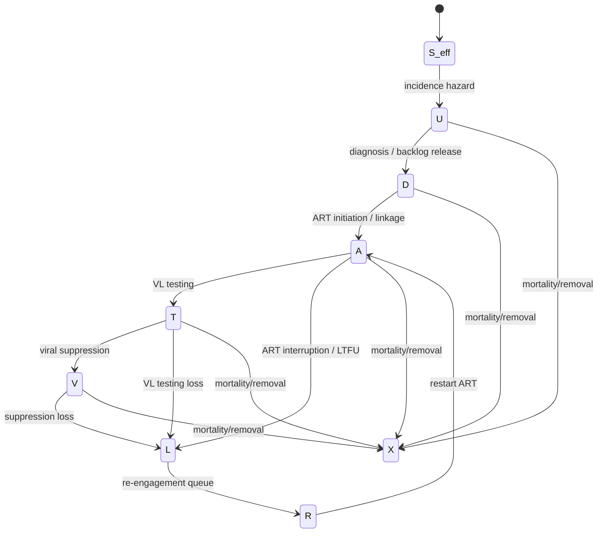
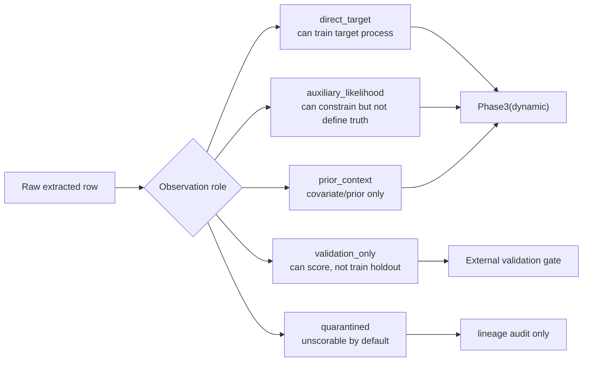

# ModelHIV-PH

> Evidence-ledger driven HIV epidemic modelling for the Philippines.
> The repository builds, falsifies, and tracks national/subnational HIV model families across evidence extraction, latent determinant graphs, and Phase 3 dynamic cascade forecasting.


This project is not a clinical tool, not an official DOH/UNAIDS/Spectrum/AEM replacement, and not a policy engine without external review. Its purpose is scientific: make every model claim traceable to data roles, blocked-time evaluation, failure anatomy, and explicit claim cards.

## Scientific Snapshot

### September 11 Update: R96 Monthly Diagnosis Test

R96 repaired a PDF extraction bug that had omitted monthly diagnosis rows: Q1 now supplies **39 months** and Q2 **42 months**, with the March revision retained separately for each report. The five-family monthly experiment improves historical MAE from **771 to 661 diagnoses** using a nested selector, but its preferred forecast is the historical mean. The fitted local-level models lose to carry-forward. Q2 error improves while Q1 regresses slightly against R41, so **R41 remains the reference and R96 is diagnostic-only**.


[Equations, all comparisons, extraction corrections, and next experiments](docs/phase3_r96_monthly_diagnosis_state_20260911.md). R96 has no prospective or AEM-superiority claim: Q2 was already inspected, and historical report issue dates have not been verified. Older R94/R95 extraction totals below describe their frozen original artifacts; corrected totals are 536 and 562 rows respectively.

| Layer | Current Status | What It Means |
| --- | --- | --- |
| National quarterly cascade | `R41` promoted as current national research champion | Useful readout/forecast champion under locked gates, not a final official-model replacement |
| Subnational modelling | readout/proxy champions exist, process claims limited | Regional claims remain constrained by sparse validation evidence |
| Annual public challenge | `R75` passes with weak-measurement annual heads | Annual incidence/deaths/PLHIV can be scored without holdout leakage, but this is not yet a quarterly mechanistic bridge |
| Public annual projection | `R80` ready | 2025-2035 public annual projection head exists as a separate annual track |
| Phase 2 determinant knobs | `R81` directional sensitivity only | Determinants can label scenarios, not provide numeric intervention effects |
| Quarterly-to-annual bridge | `R86` and `R88` scoped annual model wins | Complete quarterly ledger plus train-origin calibration/guarding beats carry-forward on held-out annual incidence, AIDS deaths, and PLHIV targets |
| Claim-grade adjudication | `R90` annual readout ready, mechanisms blocked | R86/R88 are publication-grade scoped annual/readout wins; raw incidence/death mechanism claims remain blocked by R89 |
| Mechanism-support expansion | `R91` diagnostic only | Diagnosis-flow and reported-death proxy bridges do not beat or stably improve carry-forward, so mechanism claims remain blocked |
| Process-repair queue | `R92` mortality/process signal diagnostic | Train-origin proxy process repair improves incidence/death bridges, but mechanism claims remain blocked by absent direct incidence support and mortality source-family instability |
| Open public incumbent | `R93` comparator ready, annual superiority blocked | R78 public annual proxy is now the open AEM/Spectrum-style incumbent comparator; current annual head does not beat it |
| Latest 2026-Q1 HASP intake | `R94` post-2025 holdout passes | User-provided official 2026-Q1 HASP PDF was extracted into 519 typed rows; R41 beats carry-forward on the five main 2026-Q1 program metrics |
| Latest 2026-Q2 HASP intake | `R95` stock anchor passes, diagnosis flow shock flagged | User-provided official 2026-Q2 HASP PDF was extracted into 529 typed rows; Q1-anchored R41 beats carry-forward on stock/back-half metrics but loses on new diagnoses |

### Latest R84-R95 Verdict

`R84` added a conserved quarterly annual ledger to the dynamic simulator. `R85` repaired annual support coverage by forcing every holdout year to emit Q1-Q4 ledger quantities on an unscored forecast grid. `R86` then added a train-origin annual weak-measurement calibration head. `R87` tested free raw-emission process rescaling and failed. `R88` kept the raw quarterly process only where train-window evidence beat carry-forward and guarded weak incidence/death channels with a carry-forward prior:

```text
S_eff -> incident_infections_period -> U
state-specific mortality/removal -> aids_deaths_period
U + D + A + T + V + L + R -> estimated_plhiv
```

| Annual Target | R86 Scored / Target Entries | R86 Candidate Mean Error | Carry-Forward Mean Error | Verdict |
| --- | ---: | ---: | ---: | --- |
| annual new infections | 28 / 28 | 0.2679 | 0.3116 | improves over carry-forward |
| annual AIDS deaths | 28 / 28 | 0.3947 | 0.4764 | improves over carry-forward |
| estimated PLHIV | 28 / 28 | 0.0633 | 0.3818 | improves over carry-forward |
| all annual targets | 84 / 84 | 0.2419 | 0.3900 | scoped annual model win |

Interpretation: the conserved state ledger is visible, complete, and now beats carry-forward on the annual public-target gate when annual incidence, AIDS deaths, and PLHIV are calibrated only from pre-holdout annual rows. This is a real scoped win, not a broad official-model replacement claim: raw quarterly mechanistic incidence/death emissions remain weaker before annual calibration.

R88 adds a second conservative win: all annual targets score `0.2976` versus carry-forward `0.3900`, with interval coverage `0.6429` versus `0.4881`. Its scientific meaning is different from R86: it proves the stable PLHIV stock process can improve an annual ledger when weak incidence/death raw emissions are explicitly rejected rather than overfit.

R89 then asked whether raw incidence and AIDS-death mechanisms are directly supported. It remains diagnostic-only: direct incidence-process support is absent and the reported-death bridge loses to carry-forward (`0.5529` versus `0.4764` mean normalized error). R90 is the claim-grade adjudicator over R86/R88/R89. It reports `claim_grade_annual_readout_ready_mechanisms_blocked`: R86 and R88 are safe scoped annual/readout claims, but raw incidence/death mechanism claims are still blocked.

R91 tested whether train-origin proxy bridges could repair that mechanism-support gap. They did not. Diagnosis-flow to annual incidence scored `0.4859` versus carry-forward `0.3116`; reported deaths to annual AIDS deaths tied carry-forward at `0.4764` and failed source-family stability. The result reinforced the claim boundary: the project had annual/readout wins, not identified raw incidence/death mechanisms.

R92 then replaced the simple proxy bridge with train-origin process-repair family selection. This found real signal: diagnosis-flow to annual incidence scored `0.0497` versus carry-forward `0.3116`, and reported deaths to annual AIDS deaths scored `0.1636` versus carry-forward `0.4764`, both with full interval coverage. It still does not promote a raw mechanism claim because direct incidence-process support remains zero and mortality source-family ablation is unstable. R92 is therefore a process-signal diagnostic and experiment queue, not a final model win.

R93 formalizes the open public annual incumbent comparison. The R78 public proxy v2 is now the public AEM/Spectrum-style annual incumbent, covering annual new infections, AIDS deaths, and estimated PLHIV. The current matched Phase 3 annual head scores `0.2435` versus incumbent `0.1638`, with coverage `0.7500` versus `0.9286`, so broad annual superiority is explicitly blocked.

### Latest R94 Verdict: 2026-Q1 HASP External Holdout

`R94` ingests the latest user-provided official `2026_Q1 HIV & AIDS Surveillance of the Philippines.pdf` as post-2025 evidence. It extracts a typed observation-role ledger from the PDF rather than manually copying values into the model. The extracted support includes national cascade stocks, diagnosis flow, deaths, PrEP series, ART outcomes, VL/suppression tables, regional/age/key-population cascade rows, and quality flags for non-reconciled regional totals.

The main scientific result is a true near-term holdout check: R41 is trained only through `2025-Q4`, then scored against the new `2026-Q1` HASP numbers. It beats carry-forward on all five main program metrics:

| Metric | 2026-Q1 HASP Actual | R41 Forecast | Carry-forward | R41 Absolute Error | Carry Absolute Error |
| --- | ---: | ---: | ---: | ---: | ---: |
| diagnosed PLHIV | 157,350 | 157,841 | 153,491 | 491 | 3,859 |
| alive on ART | 108,367 | 109,548 | 97,943 | 1,181 | 10,424 |
| tested for viral load | 61,413 | 60,384 | 53,987 | 1,029 | 7,426 |
| virally suppressed | 59,540 | 58,586 | 52,380 | 954 | 7,160 |
| new diagnoses, Q1 | 4,633 | 4,706 | 4,277 | 74 | 356 |

Mean normalized error is `0.0120` for R41 versus `0.0851` for carry-forward. This promotes the 2026-Q1 direct-target row as a future-forecast initialization anchor, not as a retrospective training improvement. Broad annual superiority over the open public AEM/Spectrum-style incumbent remains blocked by R93.

### Latest R95 Verdict: 2026-Q2 HASP External Holdout

`R95` ingests the newer user-provided official `2026_Q2 HIV & AIDS Surveillance of the Philippines.pdf` as a second post-2025 evidence update. It extracts `529` typed rows from the PDF: national cascade stocks, diagnosis flow, deaths, PrEP, ART outcomes, VL/suppression, regional/age/key-population cascade rows, and quality flags for regional annex totals that do not exactly reconcile to the national cascade.

The result is scientifically mixed. Using the `2026-Q1` HASP row as the previous anchor, the R41 branch beats Q1 carry-forward on the four stock/back-half metrics, but it loses on Q2 new diagnoses because the official Q2 diagnosis count dropped to `2,994`.

| Metric | 2026-Q2 HASP Actual | Q1-Anchored R41 Forecast | Q1 Carry-forward | R41 Absolute Error | Carry Absolute Error |
| --- | ---: | ---: | ---: | ---: | ---: |
| diagnosed PLHIV | 159,997 | 161,700 | 157,350 | 1,703 | 2,647 |
| alive on ART | 111,154 | 113,069 | 108,367 | 1,915 | 2,787 |
| tested for viral load | 65,630 | 64,077 | 61,413 | 1,553 | 4,217 |
| virally suppressed | 63,850 | 62,123 | 59,540 | 1,727 | 4,310 |
| new diagnoses, Q2 | 2,994 | 5,113 | 4,633 | 2,119 | 1,639 |

Overall mean normalized error is `0.0916` for R41 versus `0.0934` for Q1 carry-forward, so the full five-metric margin is narrow. The stock-only gate is stronger: `0.0196` for R41 versus `0.0433` for carry-forward. R95 therefore promotes the Q2 stock row for future forecast initialization, but it explicitly flags diagnosis flow as a reporting/service shock and blocks diagnosis-flow/incidence process claims from this update.

### Position Versus SOTA

The current model is not yet a broad replacement for Spectrum/EPP/AEM/Naomi-style official estimation systems. UNAIDS describes Spectrum/EPP as country-team annual estimation software using surveillance, programme data, demographic assumptions, uncertainty ranges, and expert review; Naomi is a Bayesian small-area model for subnational PLHIV, ART coverage, and incidence in supported settings. This repository is currently stronger as an auditable research pipeline and internal blocked-time readout system than as an official-model replacement.

The precise status is:

| Comparison | Current Status |
| --- | --- |
| Versus carry-forward | R41, R75, R86, and R88 have real wins on their scoped gates |
| Versus internal R10 family | R41 beats strict matched R10 on national 1y/3y/5y mapped routes |
| Versus open public annual incumbent | Not beaten broadly; R93 freezes R78 as the public incumbent and blocks annual superiority |
| Versus Spectrum/EPP/AEM | Not yet claimable because official Philippines files/outputs are not in the repo |
| Versus Naomi-style subnational estimation | Not yet; regional adapters are mean-promoted but split-stability is limited |

Full math and experiment audit: [phase3_full_experiment_math_and_sota_status_20260509.md](docs/phase3_full_experiment_math_and_sota_status_20260509.md).

## Figure 1: System Architecture


```mermaid
flowchart LR
    P0["Phase 0<br/>evidence extraction<br/>papers, PDFs, HARP/HASP, WDI, WHO, PSA"] --> P1["Phase 1<br/>normalization<br/>roles, units, tensors"]
    P1 --> P15["Phase 15 v2<br/>mixed-frequency latent states<br/>national/region/province"]
    P15 --> P2["Phase 2<br/>lagged determinant graph<br/>direct surfaces + hidden modes"]
    P2 --> P3["Phase3(dynamic)<br/>observation ledger + cascade dynamics"]
    P3 --> G["Blocked-time gates<br/>carry-forward, R10, annual public targets"]
    G --> C["Claim registry<br/>promote / diagnostic / blocked"]

    classDef phase fill:#eaf4ff,stroke:#1864ab,stroke-width:1px,color:#0b2545;
    classDef gate fill:#fff4db,stroke:#b26b00,stroke-width:1px,color:#3b2500;
    classDef claim fill:#eafaf1,stroke:#1b7f45,stroke-width:1px,color:#083b1f;
    class P0,P1,P15,P2,P3 phase;
    class G gate;
    class C claim;
```

## Figure 2: Current Claim Board


```mermaid
flowchart TB
    A["National R41 research champion<br/>PROMOTED"]:::pass
    B["Subnational readout/proxy layer<br/>LIMITED"]:::warn
    C["Phase 2 determinant priors<br/>SENSITIVITY ONLY"]:::warn
    D["Annual weak-measurement challenge R75<br/>PASS"]:::pass
    E["Public annual projection R80<br/>READY"]:::pass
    F["Quarterly annual bridge R82/R83<br/>BLOCKED"]:::fail
    G["Conserved annual ledger R84/R85<br/>DIAGNOSTIC ONLY"]:::warn
    I["Annual-calibrated ledger R86<br/>SCOPED WIN"]:::pass
    J["R90 claim-grade gate<br/>ANNUAL READY, MECHANISMS BLOCKED"]:::warn
    K["R91 mechanism expansion<br/>DIAGNOSTIC ONLY"]:::warn
    L["R92 process repair<br/>SIGNAL, CLAIM BLOCKED"]:::warn
    M["R93 public incumbent<br/>ANNUAL SUPERIORITY BLOCKED"]:::warn
    N["R94 2026-Q1 HASP<br/>NEAR-TERM HOLDOUT PASS"]:::pass
    O["R95 2026-Q2 HASP<br/>STOCK ANCHOR, FLOW SHOCK"]:::warn
    H["Broad 'better than official models' claim<br/>NOT YET ALLOWED"]:::fail

    A --> H
    B --> H
    C --> H
    D --> H
    E --> H
    F --> H
    G --> H
    I --> H
    J --> H
    K --> H
    L --> H
    M --> H
    N --> H
    O --> H

    classDef pass fill:#e6fcf5,stroke:#087f5b,stroke-width:2px,color:#063b2c;
    classDef warn fill:#fff9db,stroke:#f08c00,stroke-width:2px,color:#4a2a00;
    classDef fail fill:#fff5f5,stroke:#c92a2a,stroke-width:2px,color:#4d0000;
```

## Figure 3: Cascade State Model


```mermaid
stateDiagram-v2
    [*] --> S_eff
    S_eff --> U: incidence hazard
    U --> D: diagnosis / backlog release
    D --> A: ART initiation / linkage
    A --> T: VL testing
    T --> V: viral suppression
    A --> L: ART interruption / LTFU
    T --> L: VL testing loss
    V --> L: suppression loss
    L --> R: re-engagement queue
    R --> A: restart ART
    U --> X: mortality/removal
    D --> X: mortality/removal
    A --> X: mortality/removal
    T --> X: mortality/removal
    V --> X: mortality/removal
```

State variables:

| Symbol | Meaning |
| --- | --- |
| `S_eff` | effective population denominator available for new infections |
| `U` | living with HIV, undiagnosed |
| `D` | diagnosed, not on ART |
| `A` | active ART without recent VL evidence |
| `T` | VL-tested but not suppressed |
| `V` | virally suppressed |
| `L` | interrupted or lost from active pathway |
| `R` | re-engaged/restart pathway |
| `X` | removal, including mortality where supported |

## Figure 4: Evidence Role Contract


```mermaid
flowchart LR
    Raw["Raw extracted row"] --> Role{"Observation role"}
    Role --> Direct["direct_target<br/>can train target process"]
    Role --> Aux["auxiliary_likelihood<br/>can constrain but not define truth"]
    Role --> Val["validation_only<br/>can score, not train holdout"]
    Role --> Prior["prior_context<br/>covariate/prior only"]
    Role --> Q["quarantined<br/>unscorable by default"]

    Direct --> Model["Phase3(dynamic)"]
    Aux --> Model
    Prior --> Model
    Val --> Gate["External validation gate"]
    Q --> Audit["lineage audit only"]
```

The model is intentionally strict: diagnosis counts, annual incidence estimates, ART stocks, VL testing rows, determinants, and hidden modes are not interchangeable.

## Experiment Timeline

| Phase / Run | Main Question | Outcome |
| --- | --- | --- |
| Phase 0 | Can we extract structured HIV determinants and official support rows? | Yes: HARP/HASP/HIV_Data, WDI, WHO, PSA/FIES/YAFS, PhilHealth, UNAIDS-style support, literature rows |
| Phase 1 | Can heterogeneous evidence become comparable tensors? | Yes: normalized tensors, roles, units, quality weights |
| Phase 15 v2 | Can mixed-frequency evidence produce latent national/regional/provincial states? | Yes: active bridge into Phase 2 |
| Phase 2 | Can lagged determinants and hidden modes be learned robustly? | Partly: useful structural payload, but determinants remain sensitivity-only |
| TR-V3 / R10 | Can broad endpoint/readout families beat naive baselines? | Yes in old evidence universe; failed under expanded HARP/HASP support |
| R11 | Can stock-consistency and trajectory gates stabilize quarterly cascade predictions? | Partly: R11-28 became locked research reference |
| R12 | Can annual anchors and DOH program routes be separated? | Yes: route-aware evidence split clarified failure sources |
| R13-R41 | Can national readout champions survive stricter gates? | R41 promoted as current national research champion |
| R75 | Can annual public targets be challenged without leakage? | Pass with train-origin annual weak-measurement heads |
| R80 | Can public annual series be projected 2025-2035? | Ready as public annual projection head |
| R81 | Can Phase 2 become scenario knobs? | Directional sensitivity only, not numeric intervention effects |
| R82/R83 | Does the quarterly champion emit annual incidence/deaths/PLHIV directly? | Blocked: locked R11-28-style predictions do not emit those quantities |
| R84 | Can the conserved dynamic simulator emit annual ledger quantities? | Diagnostic: emissions exist, PLHIV improves, incidence/deaths are incomplete |
| R85 | Does a complete unscored quarterly forecast grid fix the annual bridge? | Diagnostic: coverage fixed, but incidence/deaths still lose to carry-forward |
| R86 | Can train-origin annual calibration turn the complete ledger into a benchmark win? | Pass: annual calibrated ledger beats carry-forward with complete validation-only target coverage |
| R87 | Can train-backtested raw emission ratio/trend calibration fix incidence/deaths? | Diagnostic: free process rescaling is unstable and loses to carry-forward |
| R88 | Can a guarded process-or-carry selector improve the annual ledger without overfitting weak channels? | Pass: guarded annual ledger beats carry-forward by retaining raw PLHIV and rejecting weak raw incidence/death |
| R89 | Is there enough direct process evidence to claim raw incidence/death mechanisms are identified? | Diagnostic: direct incidence support is absent; reported-death bridge loses to carry-forward |
| R90 | Are R86/R88/R89 safe to cite as publication claims? | Pass for scoped annual/readout claims; blocks raw incidence/death mechanism claims |
| R91 | Can train-origin proxy bridges rescue incidence/death mechanism support? | Diagnostic: diagnosis-flow incidence proxy loses; reported-death bridge only ties and is source-family unstable |
| R92 | Can train-origin process-repair families rescue incidence/death mechanism support? | Signal diagnostic: proxy process repair beats carry-forward, but direct incidence support and mortality source-family stability still block mechanism claims |
| R93 | Can we lock an open AEM/Spectrum-style public annual incumbent? | Comparator ready; annual superiority blocked because R78 public proxy v2 beats the current annual head |
| R94 | Does the current national champion survive the new official 2026-Q1 HASP PDF? | Pass as near-term holdout: R41 beats carry-forward on diagnosed PLHIV, ART, VL-tested, suppressed, and Q1 diagnoses; Q1 rows become future initialization anchors |
| R95 | Does the Q1-anchored national champion survive the official 2026-Q2 HASP PDF? | Mixed pass: stock/back-half metrics beat Q1 carry-forward, but Q2 diagnosis flow regresses and is flagged as a reporting/service shock |

## What Is Currently Defensible?

### Allowed Claims

- The repository has a staged evidence-to-model pipeline with explicit observation roles.
- The national R41-style readout is the current internal research champion under the project gates.
- Annual public targets can be scored in a leakage-aware way through R75/R80.
- R86 is a scoped annual-ledger model win against carry-forward on held-out annual incidence, AIDS deaths, and PLHIV.
- R88 is a conservative guarded annual-ledger win: it improves the annual ledger by keeping raw PLHIV and using carry-forward priors for weak incidence/death channels.
- R90 clears R86/R88 as claim-grade scoped annual/readout wins under validation-only, complete-support, per-metric, per-horizon, p90, and interval-coverage checks.
- R89 blocks raw incidence/death mechanism claims under the active evidence ledger.
- R91 confirms that diagnosis-flow and reported-death proxy bridges do not yet justify raw incidence/death mechanism claims.
- R92 shows a train-origin process-repair signal for diagnosis-flow and reported-death bridges, but only as a diagnostic/experiment queue.
- R93 provides an open public annual incumbent comparator for annual incidence, AIDS deaths, and estimated PLHIV.
- R94 shows the frozen R41 national branch generalizes well to the newly supplied 2026-Q1 official HASP program metrics.
- The 2026-Q1 HASP direct-target row can initialize forecasts after 2026-Q1; it cannot be used to claim a retroactive Q1 training improvement.
- R95 shows the Q1-anchored R41 branch remains useful for 2026-Q2 stock/back-half initialization, but diagnosis flow is shock-flagged and cannot support incidence-process claims.
- The 2026-Q2 HASP stock row can initialize forecasts after 2026-Q2; it cannot be used to retroactively tune the Q2 holdout or claim normal diagnosis-flow dynamics.
- Phase 2 determinant structure can be used for sensitivity/scenario labels only.
- R84 exposes the key mechanistic annual ledger quantities in the simulator.
- R85 shows the annual bridge failure was process quality, not missing quarterly emission coverage.

### Not Yet Allowed

- “This beats AEM/Spectrum overall.”
- “Phase 2 graph edges are causal intervention effects.”
- “Subnational process model is validated province-by-province.”
- “The raw quarterly mechanistic incidence/death process beats annual public targets without annual calibration.”
- “The raw incidence and AIDS-death mechanisms are identified from direct process evidence.”
- “R92’s proxy bridge is an identified incidence or mortality mechanism.”
- “The current annual head beats the open public annual incumbent.”
- “Third-95 process claims are fully identified without stronger VL/suppression process evidence.”

## Repository Map

```text
src/epigraph_ph/plugins/hiv.py
    HIV domain contract: latent blocks, transitions, evidence families.

src/epigraph_ph/harp_archive
    HARP/HASP/HIV_Data extraction and support data.

src/epigraph_ph/phase0
    Evidence extraction, citation ledgers, official determinant bridges.

src/epigraph_ph/phase1
    Normalization, observation roles, tensors.

src/epigraph_ph/phase15
    Mixed-frequency latent state layer.

src/epigraph_ph/phase2
    Direct temporal surfaces, hidden modes, determinant robustness.

src/epigraph_ph/Phase3(dynamic)
    Current canonical dynamic modelling package and experiment gates.

src/epigraph_ph/phase3
    Historical TR-V2/TR-V3/R10 lineage; useful for comparison, not canonical for new claims.
```

## Key Phase3(dynamic) Files

| File | Role |
| --- | --- |
| `data.py` | observation rows, state construction, stock-flow support |
| `model.py` | dynamic hazards, incidence inflow, conservation, observation heads |
| `r11_sparse_state_space.py` | R11-R41 candidate families and blocked-time gates |
| `r53_publication_claim_registry.py` | claim registry and allowed-use summary |
| `r75_bulk_unaids_annual_challenge.py` | annual public/UNAIDS-style validation gate |
| `r80_public_annual_projection_head.py` | public annual projection head |
| `r81_phase2_knob_admissibility_gate.py` | determinant knob admissibility |
| `r82_quarterly_annual_bridge_gate.py` | required bridge contract |
| `r83_quarterly_emission_bridge_audit.py` | actual quarterly prediction-emission audit |
| `r84_conserved_quarterly_annual_ledger.py` | conserved dynamic annual ledger audit |
| `r90_claim_grade_gate.py` | claim-grade adjudication over R86/R88/R89 |
| `r91_mechanism_support_expansion_gate.py` | proxy bridge and source-family ablation gate for incidence/death mechanisms |
| `r92_process_repair_experiment_queue.py` | train-origin process-repair queue for incidence/death mechanism support |
| `r93_open_public_incumbent_comparator.py` | open public AEM/Spectrum-style annual incumbent comparator |

## How To Reproduce The Latest Gates

```bash
cd /home/gaurav/codex_work/ModelHIV-PH

PYTHONPATH='src/epigraph_ph/Phase3(dynamic)/src' \
  uvx --with numpy python -m phase3_dynamic.r86_annual_calibrated_forecast_grid_ledger

PYTHONPATH='src/epigraph_ph/Phase3(dynamic)/src' \
  uvx --with numpy python -m phase3_dynamic.r88_guarded_annual_ledger_selector

PYTHONPATH='src/epigraph_ph/Phase3(dynamic)/src' \
  uvx --with numpy python -m phase3_dynamic.r89_incidence_mortality_mechanism_support_gate

PYTHONPATH='src/epigraph_ph/Phase3(dynamic)/src' \
  uvx --with numpy python -m phase3_dynamic.r90_claim_grade_gate

PYTHONPATH='src/epigraph_ph/Phase3(dynamic)/src' \
  uvx --with numpy python -m phase3_dynamic.r91_mechanism_support_expansion_gate

PYTHONPATH='src/epigraph_ph/Phase3(dynamic)/src' \
  uvx --with numpy python -m phase3_dynamic.r92_process_repair_experiment_queue

PYTHONPATH='src/epigraph_ph/Phase3(dynamic)/src' \
  uvx --with numpy python -m phase3_dynamic.r93_open_public_incumbent_comparator

PYTHONPATH='src/epigraph_ph/Phase3(dynamic)/src' \
  uvx --with numpy python -m phase3_dynamic.r53_publication_claim_registry

PYTHONPATH='src/epigraph_ph/Phase3(dynamic)/src' \
  uvx --with numpy --from pytest pytest \
  'src/epigraph_ph/Phase3(dynamic)/tests/test_r90_claim_grade_gate.py' \
  'src/epigraph_ph/Phase3(dynamic)/tests/test_r91_mechanism_support_expansion_gate.py' \
  'src/epigraph_ph/Phase3(dynamic)/tests/test_r92_process_repair_experiment_queue.py' \
  'src/epigraph_ph/Phase3(dynamic)/tests/test_r93_open_public_incumbent_comparator.py' \
  -q
```

Expected latest focused test result:

```text
14 passed
```

## Latest Artifacts

| Artifact | Path |
| --- | --- |
| Claim registry | `src/epigraph_ph/Phase3(dynamic)/artifacts/runs/p3d-r53-publication-claim-registry-20260503-s00/analysis/r53_publication_claim_registry_report.json` |
| R83 emission audit | `src/epigraph_ph/Phase3(dynamic)/artifacts/runs/p3d-r83-quarterly-emission-bridge-audit-20260507-s00/analysis/r83_quarterly_emission_bridge_audit_report.json` |
| R84 conserved ledger | `src/epigraph_ph/Phase3(dynamic)/artifacts/runs/p3d-r84-conserved-quarterly-annual-ledger-20260507-s00/analysis/r84_conserved_quarterly_annual_ledger_report.json` |
| R85 forecast grid ledger | `src/epigraph_ph/Phase3(dynamic)/artifacts/runs/p3d-r85-annual-ledger-forecast-grid-20260507-s00/analysis/r85_annual_ledger_forecast_grid_report.json` |
| R86 annual-calibrated forecast grid ledger | `src/epigraph_ph/Phase3(dynamic)/artifacts/runs/p3d-r86-annual-calibrated-forecast-grid-ledger-20260507-s00/analysis/r86_annual_calibrated_forecast_grid_ledger_report.json` |
| R86 tracked GitHub summary | `docs/phase3_r86_annual_calibrated_ledger_summary_20260507.md` |
| R87 process calibration diagnostic | `src/epigraph_ph/Phase3(dynamic)/artifacts/runs/p3d-r87-train-backtested-emission-process-calibration-20260507-s00/analysis/r87_train_backtested_emission_process_calibration_report.json` |
| R88 guarded annual ledger selector | `src/epigraph_ph/Phase3(dynamic)/artifacts/runs/p3d-r88-guarded-annual-ledger-selector-20260507-s00/analysis/r88_guarded_annual_ledger_selector_report.json` |
| R88 tracked GitHub summary | `docs/phase3_r88_guarded_annual_ledger_summary_20260507.md` |
| R89 incidence/mortality support gate | `src/epigraph_ph/Phase3(dynamic)/artifacts/runs/p3d-r89-incidence-mortality-mechanism-support-gate-20260507-s00/analysis/r89_incidence_mortality_mechanism_support_gate_report.json` |
| R89 tracked GitHub summary | `docs/phase3_r89_mechanism_support_summary_20260507.md` |
| R90 claim-grade gate | `src/epigraph_ph/Phase3(dynamic)/artifacts/runs/p3d-r90-claim-grade-gate-20260509-s00/analysis/r90_claim_grade_gate_report.json` |
| R90 tracked GitHub summary | `docs/phase3_r90_claim_grade_gate_summary_20260509.md` |
| R91 mechanism-support expansion gate | `src/epigraph_ph/Phase3(dynamic)/artifacts/runs/p3d-r91-mechanism-support-expansion-gate-20260509-s00/analysis/r91_mechanism_support_expansion_gate_report.json` |
| R91 tracked GitHub summary | `docs/phase3_r91_mechanism_support_expansion_summary_20260509.md` |
| R92 process-repair experiment queue | `src/epigraph_ph/Phase3(dynamic)/artifacts/runs/p3d-r92-process-repair-experiment-queue-20260509-s00/analysis/r92_process_repair_experiment_queue_report.json` |
| R92 tracked GitHub summary | `docs/phase3_r92_process_repair_experiment_queue_summary_20260509.md` |
| R93 open public incumbent comparator | `src/epigraph_ph/Phase3(dynamic)/artifacts/runs/p3d-r93-open-public-incumbent-comparator-20260510-s00/analysis/r93_open_public_incumbent_comparator_report.json` |
| R93 tracked GitHub summary | `docs/phase3_r93_open_public_incumbent_comparator_summary_20260510.md` |
| R94 2026-Q1 HASP intake gate | `src/epigraph_ph/Phase3(dynamic)/artifacts/runs/p3d-r94-2026-q1-hasp-intake-gate-20260520-s00/analysis/r94_2026_q1_hasp_intake_gate_report.json` |
| R95 2026-Q2 HASP intake gate | `src/epigraph_ph/Phase3(dynamic)/artifacts/runs/p3d-r95-2026-q2-hasp-intake-gate-20260910-s00/analysis/r95_2026_q2_hasp_intake_gate_report.json` |
| R95 tracked GitHub summary | `docs/phase3_r95_2026_q2_hasp_intake_summary_20260910.md` |
| Full experiment/math/SOTA audit | `docs/phase3_full_experiment_math_and_sota_status_20260509.md` |

## Roadmap


```mermaid
flowchart LR
    R85["R85 forecast grid ledger<br/>diagnostic only"] --> R86["R86 annual-calibrated ledger<br/>scoped annual win"]
    R86 --> R87["R87 raw emission ratio calibration<br/>diagnostic only"]
    R87 --> R88["R88 guarded annual ledger<br/>scoped conservative win"]
    R88 --> R89["R89 mechanism support gate<br/>diagnostic only"]
    R89 --> R90["R90 claim-grade adjudication<br/>annual ready, mechanisms blocked"]
    R90 --> R91["R91 mechanism-support expansion<br/>diagnostic only"]
    R91 --> R92["R92 process repair<br/>signal, claim blocked"]
    R92 --> R93["R93 public incumbent comparator<br/>ready, model blocked"]
    R93 --> R94["R94 2026-Q1 HASP<br/>holdout pass"]
    R94 --> R95["R95 2026-Q2 HASP<br/>stock anchor, flow shock"]
```

Next highest-value scientific step:

1. Freeze R86/R88 as scoped annual/readout claims under R90.
2. Treat R92 as a useful process-signal diagnostic, not a mechanism win.
3. Treat R93 as the open annual incumbent comparator and keep broad annual superiority blocked.
4. Use R95 as a stock initialization anchor after 2026-Q2, but model the Q2 diagnosis-flow collapse as a reporting/service-intensity shock before making any incidence-process claim.

## License And Use

This is research software for epidemiological modelling and scientific audit. Treat all outputs as exploratory unless the relevant claim is promoted in the claim registry and independently reviewed.
