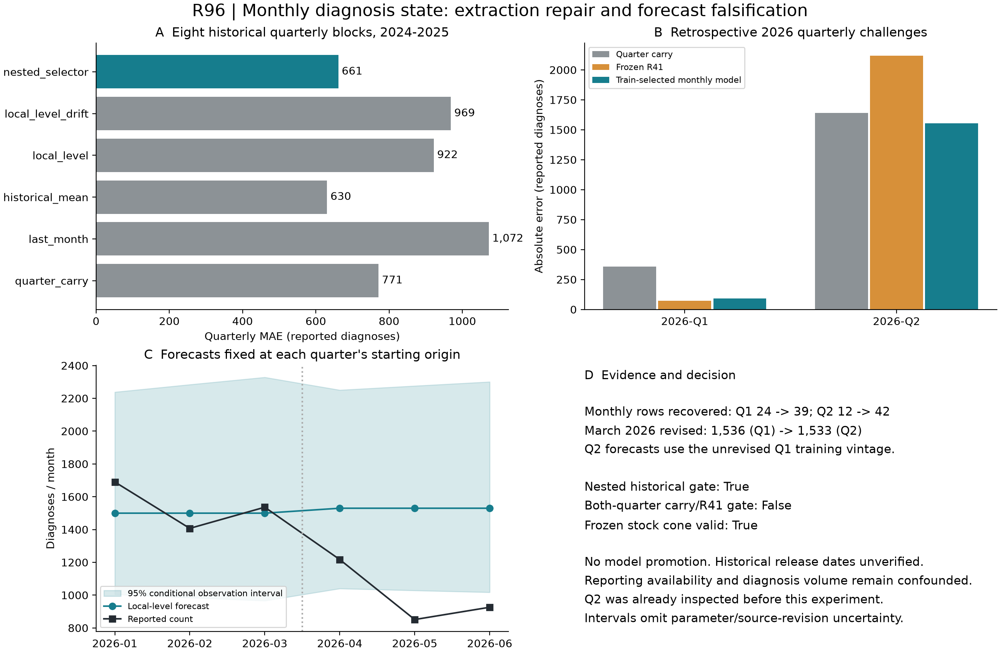

# R96: recovered monthly observations and diagnosis-state falsification

Date: 2026-09-11. Canonical experiment: `p3d-r96-monthly-diagnosis-state-20260911-s01`.

**Decision:** retain the extraction repair and experiment infrastructure. Do not replace R41 with this monthly model. The nested selector improves historical diagnosis forecasting, but its preferred model is the historical mean. Neither fitted state model improves historical MAE over quarterly carry-forward. The selected forecast improves Q2 while regressing slightly against R41 in Q1.



Figure provenance: user-provided DOH HASP 2026-Q1 and 2026-Q2 PDFs, Figure 3; eight nonoverlapping quarterly test blocks in 2024-2025 and two retrospective challenges in 2026. Counts measure reported diagnoses, not infections. The shaded interval is a 95% conditional observation interval from the log-scale local-level model; it excludes parameter and report-revision uncertainty. Q2 was already inspected before R96 was designed. The fitted model in panel C is an ablation, not the selector winner. The flat forecast follows a random-walk level without drift: future innovations have mean zero. May and June fall below its conditional interval.

## Extraction correction

The former regex required the year to start the entire text line. In the real two-column PDF, left-column prose precedes several right-column table rows. Consequently, the prior Q1 artifact contained only 24 monthly rows and the Q2 artifact only 12, although their national quarterly totals were present.

The shared parser now isolates Figure 3, reads the numeric suffix after the year, requires the exact number of monthly cells plus the printed average, verifies integer-average rounding, and fails on missing/duplicate years. It recovers **39 Q1 monthly rows and 42 Q2 monthly rows**. Full corrected extraction contains **536 Q1 rows and 562 Q2 rows**. These are extraction totals, not counts of independent observations.

March 2026 is 1,536 in Q1 and 1,533 in Q2. We retain both. Q2-origin fitting uses the unrevised Q1 history; the three Q2 target months are 1,217, 851 and 926, totaling 2,994. No Q2 revision to training history is allowed into that replay. Historical R94/R95 artifacts are preserved, and the corrected ledger is stored separately.

## Locked evaluation

- Initial training support: one complete calendar year, 2023. This is an evaluation design choice, not an epidemiological parameter.
- Outer tests: eight complete, nonoverlapping quarters, 2024-Q1 through 2025-Q4. Every family refits using earlier months only.
- Inner selection: choose the family with the lowest mean quarterly absolute error on completed earlier blocks. The first outer block defaults to quarterly carry-forward because no inner score exists.
- Q1 and Q2 challenges: select on earlier blocks only. Q1 uses the Q1 report's history through December 2025; Q2 uses its history through March 2026. Future reported values cannot affect the same-origin prediction or selection.
- Primary error: absolute difference between reported quarterly count and sum of monthly point predictions. Also record p90 absolute error and error scaled by the training mean quarterly count.
- The five families and scoring rules are in the run's `contract.json`, written before fitting. There is no parameter-budget or factor-combination sweep.

| Family | Historical quarterly MAE | p90 absolute error | Decision |
| --- | ---: | ---: | --- |
| Previous quarter repeated | 771.00 | 1,425.50 | Hard baseline |
| Last month repeated | 1,072.38 | 2,390.70 | Reject |
| Expanding historical mean | 630.49 | 1,069.22 | Retain as stronger comparison baseline |
| Fitted local level | 921.83 | 1,840.48 | Reject as replacement |
| Fitted local level with drift | 968.56 | 2,122.25 | Reject as replacement |
| Nested selector | 661.36 | 1,317.38 | Historical improvement, full promotion gate fails |

The nested selector improves MAE by 14.22% relative to quarterly carry-forward. The lower full-history score of the historical mean is an ablation result, not permission to retrospectively select it on every outer fold.

| Challenge | Actual diagnoses | Selected prediction | Selected error | Monthly-vintage carry error | Frozen R41 error |
| --- | ---: | ---: | ---: | ---: | ---: |
| 2026-Q1 | 4,633 | 4,540.92 | 92.08 | 359.00 | 73.50 |
| 2026-Q2 | 2,994 | 4,548.00 | 1,554.00 | 1,639.00 | 2,119.00 |

Both challenge selections choose the historical mean using earlier data. Q1's monthly-vintage carry is 4,274, whereas the old R94 quarterly payload used 4,277. Both values are disclosed in the machine-readable report; they are not silently treated as identical lineages. R41 comparisons use frozen R94/R95 predictions, without refitting that champion or matching its historical training universe to the new monthly series. Thus these are target-matched forecast comparisons, not controlled architecture comparisons.

## Mathematics and interpretation

For monthly reported diagnoses `Y_t`, the state candidates use

\[
 z_t=\log(1+Y_t)=\ell_t+\epsilon_t,\qquad
 \ell_t=\ell_{t-1}+d+\eta_t,
\]
\[
 \epsilon_t\sim N(0,(1-\theta)\sigma^2),\qquad
 \eta_t\sim N(0,\theta\sigma^2),\qquad 0\leq\theta\leq1.
\]

`ell_t` is the unobserved level of **reported diagnosis intensity**. `epsilon_t` is transient observation variation. `eta_t` is persistent movement in that level. `d` is monthly drift, fixed at zero in the local-level ablation and estimated in the drift ablation. `theta` divides variance between persistent and transient variation; `sigma^2` is its total scale. Their numerical estimates are not proof of separately identified reporting and biological processes.

With normalized measurement variance `R=1-theta`, initialize the diffuse-filter posterior after the first observation as `m_1=z_1`, `P_1=R`. For each subsequent month:

\[
 a_t=m_{t-1}+d,\quad P_t^-=P_{t-1}+\theta,\quad
 F_t=P_t^-+(1-\theta),\quad v_t=z_t-a_t,
\]
\[
 K_t=P_t^-/F_t,\quad m_t=a_t+K_tv_t,\quad P_t=(1-K_t)P_t^-.
\]

The filter predicts the next level, measures the prediction error, and decides how much to revise the level. The gain `K_t` follows fitted uncertainty; it is not a manually selected adjustment. Exact diffuse initialization avoids inventing a large initial-state variance.

For each variance allocation, drift (if included) and scale are profiled from training innovations. Specifically, if `v_t(d)=v_t(0)-b_t d`,

\[
 \hat d={\sum_t b_t v_t(0)/F_t\over\sum_t b_t^2/F_t},\qquad
 \hat\sigma^2={1\over n-1}\sum_{t=2}^n {v_t(\hat d)^2\over F_t}.
\]

Numerical scalar likelihood minimization estimates `theta`, with both boundary solutions also evaluated. Likelihood constants independent of the parameters are omitted. Only machine precision protects logarithms at zero scale. Count forecasts are `max(0,exp(m+h*d)-1)`; quarterly predictions sum monthly marginal medians. That sum is not claimed to be the exact median of a quarterly sum. This Gaussian model on log-counts is an approximation, not a Poisson observation model.

For observed Q2 outcomes, standardized innovations are also saved, along with `s/sqrt(1+s^2)` as a bounded descriptive score. These post-outcome scores do not enter Q2 predictions or modify biological hazards.

## What the evidence allows

All four frozen R41 stock predictions and their conditional VL/suppression ratios remain unchanged and satisfy `diagnosed >= ART >= VL-tested >= suppressed >= 0`. This is an observation-head comparison. It does **not** prove new stock-flow reconciliation or mechanistic conservation for a coupled diagnosis model.

The full gate fails because Q1 regresses against R41, historical publication dates are unverified, and Q2 was known before model design. R96 cannot establish a prospective model win. Its claimed scope is retrospective forecasting of reported diagnosis counts. No national champion replacement, regional effect, incidence mechanism, or AEM/Spectrum superiority follows from this run.

Q2 alone cannot identify whether the drop is reduced testing, delayed reporting, altered care access, fewer diagnoses, or another process. In an observation equation `E[Y_t]=q_t*D_t`, multiplying diagnosis volume `D_t` by a factor and dividing ascertainment `q_t` by that factor leaves the observed expectation unchanged wherever parameter bounds permit it. Additional counts of the same stream do not remove that ambiguity.

## Cross-domain methods and next experiments

| Source domain and construct | HIV mapping | Test and failure mode | Priority |
| --- | --- | --- | --- |
| Control theory: latent state plus noisy measurement, innovation filtering | Persistent reported-diagnosis level plus transient variation | R96 prefix-only quarterly replay; rejected when MAE/p90 or R41 comparisons regress | Implemented; fitted variants rejected |
| Astronomy: unknown source brightness versus uncertain detector sensitivity | Diagnosis volume versus reporting/participation completeness | Obtain independent monthly facility participation, testing volume, or repeated report vintages; reject separate-process claims if their likelihood remains confounded | Highest next evidence task |

These are mathematical transfers, not evidence that astronomy or control methods automatically outperform HIV models.

1. Construct an issue-date-aware revision table from original monthly/quarterly HASP releases: event month, report issue date, count as then reported, and later revised count. Keep missing dates explicit. Compare vintage-safe hindcasts against this retrospective baseline.
2. Add independently observed monthly laboratory/facility participation or HIV-testing volume, if publicly available. Test whether this exposure improves diagnosis forecasts after temporal blocking; do not substitute the number of extracted rows as a completeness denominator.
3. Only after those tests pass, couple diagnosed counts to the latent `U -> D` flow with observation completeness and the existing stock-flow constraints. Preserve incidence validation roles and require stability across report lineages. Additional free latent shock factors cannot resolve absent independent measurement.

The supporting epidemiological work explicitly treats delayed reporting as an observation problem and discusses external information and sensitivity analyses: [Beesley, Osthus and Del Valle, PLOS Computational Biology (2022), arXiv record](https://arxiv.org/abs/2110.14533). The state-estimation formulation follows the standard likelihood/filtering construction documented by [statsmodels, Local Linear Trends](https://www.statsmodels.org/stable/examples/notebooks/generated/statespace_local_linear_trend.html). R96 implements the scalar level and fixed-drift variants directly with NumPy/SciPy; it does not use a statsmodels fitted object.

## Reproducibility

Run from the project root with a fresh output directory:

```bash
PYTHONPATH='src/epigraph_ph/Phase3(dynamic)/src' \
  uvx --from pytest --with numpy --with scipy --with matplotlib \
  python -m phase3_dynamic.r96_monthly_diagnosis_state --plot \
  --output-dir 'src/epigraph_ph/Phase3(dynamic)/artifacts/runs/r96-reproduction'
```

Inputs are the tracked Q1/Q2 PDFs and frozen local R94/R95 reports. The lightweight published bundle contains [results](phase3_r96_results_20260911.json), [ledger](phase3_r96_observation_ledger_20260911.json), [manifest](phase3_r96_manifest_20260911.json), and [claim card](phase3_r96_claim_card_20260911.json). Frozen R94/R95 reports are included under `docs/r96_inputs/` for reproduction in a fresh checkout. The manifest records original paths and hashes; use the function's `r94_path`/`r95_path` inputs when reproducing from those copies.

The original R94/R95 reports and the initial R96 `s00` run remain untouched. `s01` repeats the same experiment with complete CSV/claim/figure manifest export. No model family or scoring rule changed between these runs.

Verification: 17 focused tests passed, including real-PDF completeness, average reconciliation, role/quarantine rejection, missing-month rejection, filter limiting cases, nonnegative intervals, holdout-mutation invariance, and claim-registry non-promotion. The R53 registry was regenerated under its own R96 run ID.
