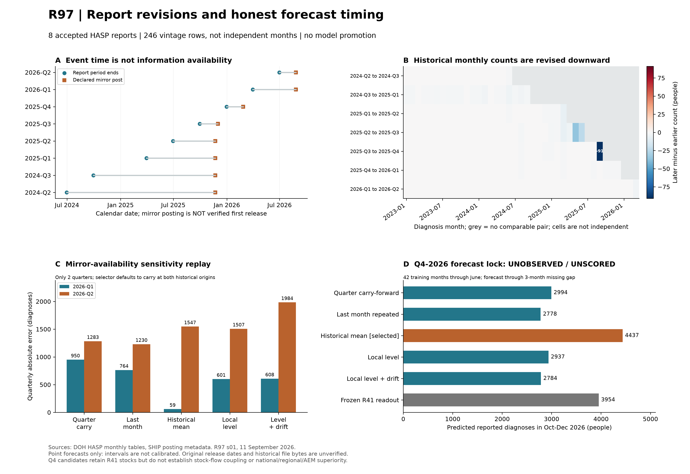

# R97: Report vintages, availability sensitivity, and a prospective forecast lock

Run: `p3d-r97-report-vintages-20260911-s01`. **Diagnostic-only. R41 is unchanged; no new model champion.**



## Scientific finding

Eight quarterly reports yield 246 report-month rows. Two reports remain quarantined because OCR does not agree. Among 204 adjacent-vintage same-month comparisons, 43 change downward and 0 upward. These are repeated measurements of overlapping months, not independent samples. September 2025 is revised from 1,799 to 1,708 diagnoses (-91). This falsifies an additions-only representation of these observed revisions. It does not identify their cause as deduplication, reporting failure, or a biological change.

The SHIP mirror lists Q4-2025 on 26 February 2026 and both Q1/Q2-2026 on 26 August 2026. Under that declared-availability assumption, January 2026 can use Q3-2025, and April can use Q4-2025. Neither replay can use the preceding quarter as if it had already been published. [Source: SHIP registry](https://www.ship.ph/category/hiv-aids-art-registry/). These are **not verified original DOH release dates**, and currently mirrored PDF bytes are not proof of what a forecaster could download historically. The replay is therefore a sensitivity analysis, not repaired prospective evidence.

## What was implemented

- Preserve each report's own history and SHA-256; never overwrite an earlier history with later revisions.
- Extract numeric PDF rows or require unique agreement between Tesseract segmentation modes 3 and 6. Use a whole-page fallback only when the right-column extraction fails. Agreement is a consistency check, not independent proof of OCR accuracy.
- Check rounded printed averages where available. Mask zeros printed after a report's coverage end; they are not observed future zeros.
- Filter training reports by both period end and posting timestamp. Propagate every intervening unobserved month.
- Select among the five frozen R96 families only using prior target blocks whose reports were posted by the origin. No complete selection blocks are available at the two historical origins, so the selector uses carry-forward.
- Keep confirming-laboratory counts as context only, not monthly reporting-completeness denominators or incidence truth.

## Mathematics and meaning

Let $y_t^{(v)}$ be the reported diagnosis count for month $t$ in report vintage $v$, $e_v$ its coverage end, and $p_v$ its mirror posting time. At issue time $o$, choose

$$v(o)=\arg\max_{v:p_v\le o,\ e_v<o} e_v.$$

In English: use the latest report that the declared source had actually posted, not the report whose calendar label looks most recent.

For a target quarter starting in month $s$, let $g=s-e_{v(o)}-1$ be the unobserved gap in months. Then

$$\widehat Y_{s:s+2}^{(f,o)}=\sum_{h=g+1}^{g+3}\widehat y_{e_{v(o)}+h}^{(f)}.$$

In English: forecast through missing intermediate months before summing the three target months. A quarterly carry-forward repeats the last observed three months, a last-month baseline repeats one count, and a historical mean averages only the selected report's available prefix.

The frozen state families use $z_t=\log(1+y_t)$, $z_t=\ell_t+\epsilon_t$, and $\ell_t=\ell_{t-1}+d+\eta_t$. Here $\epsilon_t\sim N(0,R)$ is observation noise, $\eta_t\sim N(0,Q)$ is state noise, and $d=0$ for local level. The drift and variances are fitted using only the training history, with exact diffuse initialization. They represent reported-count intensity, not a separately identified biological incidence hazard. Inverse-log point forecasts are not asserted to be calibrated predictive means or intervals; [R96 documents the fitting and limitations](phase3_r96_monthly_diagnosis_state_20260911.md).

The revision diagnostic is $\Delta_t^{v,w}=y_t^{(w)}-y_t^{(v)}$ for $w>v$. Negative values require a signed revision process if modeled. Overlapping vintage differences must not be treated as independent observations of a delay distribution.

## Comparison under the same availability rule

The outcome is the sum of that target report's three monthly table cells, not annual incidence or a substituted headline count. Q1 truth is 4,633; Q2 truth is 2,994. Original R96/R41 retrospective scores use a different availability contract and cannot be ranked against this table as if all inputs matched.

| Family | Q1 prediction | Q1 absolute error | Q2 prediction | Q2 absolute error | Mean error |
|---|---:|---:|---:|---:|---:|
| Quarter carry-forward | 5,583.0 | 950.0 | 4,277.0 | 1,283.0 | 1,116.5 |
| Last month repeated | 5,397.0 | 764.0 | 4,224.0 | 1,230.0 | 997.0 |
| Historical mean | 4,574.1 | 58.9 | 4,541.4 | 1,547.4 | 803.2 |
| Local level | 5,234.2 | 601.2 | 4,501.2 | 1,507.2 | 1,054.2 |
| Local level + drift | 5,240.9 | 607.9 | 4,978.2 | 1,984.2 | 1,296.1 |

The historical mean has the lowest pooled error, but loses to carry-forward on Q2. The historical selector cannot retroactively pick it for either origin. Two previously inspected quarters do not support a superiority claim.

## Prospective Q4-2026 lock

Generated `2026-09-11T11:37:15.098480+00:00`, before 1 October 2026. Training ends June 2026; July-September are an unobserved gap. The previously specified selector now has both published challenge outcomes and chooses the historical mean. This family selection is development on known outcomes; only Q4 is future validation.

| Candidate | Oct-Dec 2026 reported diagnoses | Status |
|---|---:|---|
| Quarter carry-forward | 2,994.0 | Frozen comparator; unscored |
| Last month repeated | 2,778.0 | Frozen comparator; unscored |
| Historical mean | 4,436.8 | Selected; unscored |
| Local level | 2,937.3 | Frozen comparator; unscored |
| Local level + drift | 2,784.2 | Frozen comparator; unscored |
| Frozen R41 readout | 3,954.0 | Unscored |

Use the first complete Q4 HASP monthly table for the primary outcome; score later revisions separately. Missing outcomes stay null. One future quarter cannot promote a full-cascade model. These are point forecasts, not fan charts with calibrated uncertainty. The R41 stock vector remains unchanged and satisfies its stock cone; that does **not** prove the diagnosis-flow replacements are mass-balanced with those stocks.

[Immutable prospective lock](phase3_r97_prospective_Q4_lock_20260911.json) | [Full results](phase3_r97_results_20260911.json) | [Observation ledger](phase3_r97_observation_ledger_20260911.json) | [Reproducibility manifest](phase3_r97_bundle_manifest_20260911.json)

## Cross-domain transfers and next experiments

1. Multi-epoch survey calibration: compare the same time cell across report vintages, analogous to repeated measurements under revised calibration. This is valid for detecting measurement revision, not for assuming its cause. Test a signed revision observation model only after more vintage pairs and first-release evidence are available.
2. Delayed-measurement filtering: carry the latent state through unobserved months instead of pretending a late report arrived at its event date. The delay mapping is explicit in the equation above; the uncertainty grows with the gap. Test it against the frozen Q4 predictions and subsequently calibrated interval coverage.
3. Highest-value mechanism check: represent unknown CD4/AHD status explicitly before using late-diagnosis fractions to identify backlog/incidence. The Q2 footnote states that 1,732 of 2,166 nominally non-advanced cases lack immunologic/clinical criteria. Do not turn missingness into evidence of early disease or impute a causal re-engagement channel. [DOH Q2-2026 report, page 1](https://www.ship.ph/wp-content/uploads/2026/08/2026_Q2-HIV-AIDS-Surveillance-of-the-Philippines-2.pdf).

## Reproduction

```bash
export PYTHONPATH='src/epigraph_ph/Phase3(dynamic)/src'
# numpy, scipy; pdftotext/pdftoppm; Tesseract with English data for image tables
python3 -m phase3_dynamic.r97_hasp_report_vintages --output-dir /path/to/new-run --tesseract /path/to/tesseract
# matplotlib additionally required for the report bundle
python3 -m phase3_dynamic.r97_report --report /path/to/new-run/report.json --project-root /path/to/ModelHIV-PH
```

The freeze command refuses to run once Q4 has begun. For later reproduction of the historical results, use the tracked report, OCR/metadata snapshots and their checksums rather than creating a backdated prospective lock. Heavy rendered pages are deleted after extraction; snapshots retain only small text/metadata files. The s00 run remains archived as the pre-fallback diagnostic, not silently overwritten.
