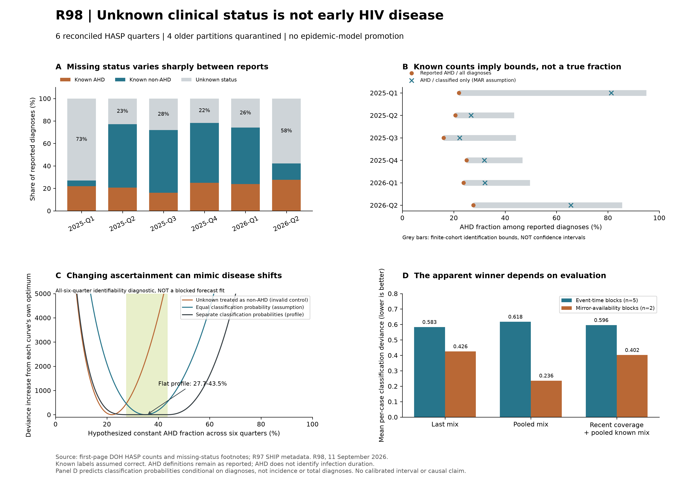

# R98: AHD ascertainment and diagnosis-delay evidence

Run `p3d-r98-ahd-missingness-20260911-s00`. **Observation-layer correction implemented and tested; no new epidemic champion.**



## What the audit found

The historical backlog implementation equates a reported AHD count with the latent late-diagnosis count, even without a measured classification denominator. It also ranks median CD4 values and averages those ranks with reported AHD proportions. A CD4 rank is not a disease probability. The affected historical code is `diagnosis_incidence_repair.py`, `_late_diagnosis_emission_observations` and `_backlog_emission_losses`. Its diagnosis-share/count targets are also correlated, and its equal-component loss is not a joint count likelihood.

R98 does not silently rewrite frozen experiments or replace the R41 reference. It provides a separate typed observation module, an exact profile likelihood, and a tested adapter to the conserved monthly backlog simulator. The old proxy-rank path is **not** accepted as evidence of identified late-diagnosis mechanisms. The new adapter is candidate-only, not yet a promoted full-model fit. No monthly incidence truth or biochemical CD4 trajectory was invented.

## Extracted evidence

The six 2025-Q1 to 2026-Q2 reports explicitly say that some nominally non-advanced cases have missing criteria. Known non-AHD is therefore nominal non-advanced minus that missing subgroup. Exact reconciliation with the same report's diagnosis denominator is required. Four 2024 footnotes use ambiguous containment or inconsistent totals and stay quarantined; no count is repaired by guesswork.

| Report | Diagnoses | Known AHD | Known non-AHD | Unknown | As-reported AHD fraction | Classified-only fraction | Identification bounds |
|---|---:|---:|---:|---:|---:|---:|---:|
| 2025-Q1 | 5,101 | 1,122 | 258 | 3,721 | 22.0% | 81.3% | 22.0%-94.9% |
| 2025-Q2 | 4,979 | 1,026 | 2,814 | 1,139 | 20.6% | 26.7% | 20.6%-43.5% |
| 2025-Q3 | 5,583 | 895 | 3,118 | 1,570 | 16.0% | 22.3% | 16.0%-44.2% |
| 2025-Q4 | 4,277 | 1,069 | 2,278 | 930 | 25.0% | 31.9% | 25.0%-46.7% |
| 2026-Q1 | 4,633 | 1,104 | 2,333 | 1,196 | 23.8% | 32.1% | 23.8%-49.6% |
| 2026-Q2 | 2,994 | 828 | 434 | 1,732 | 27.7% | 65.6% | 27.7%-85.5% |

For Q2-2026, 27.7% is the fraction *documented* advanced; 65.6% is the fraction advanced *among classified cases*. Neither is automatically the AHD fraction among all reported diagnoses. The sharp finite-cohort range is 27.7%-85.5% if known labels are correct and missing labels unrestricted. This is not a confidence interval, not a bound on national HIV prevalence, and not a measured undiagnosed backlog. [DOH Q2-2026, page 1](https://www.ship.ph/wp-content/uploads/2026/08/2026_Q2-HIV-AIDS-Surveillance-of-the-Philippines-2.pdf).

HASP definitions are preserved as reported, not retrospectively changed to newer thresholds. The 2025 WHO guideline also has age-specific conditions and a CD4 threshold differing from some report text; harmonization needs individual/stratified evidence. [WHO definition](https://www.ncbi.nlm.nih.gov/books/NBK620073/).

## Mathematics in plain English

Write $A$ for known AHD cases, $E$ for known non-AHD, $M$ for missing status, and $N=A+E+M$. Let $p$ be the AHD fraction among reported diagnoses and $q_A,q_E$ the probabilities that AHD and non-AHD status are classified. Then

$$ (A,E,M)\mid N \sim \operatorname{Multinomial}\left[N;\ p q_A,\ (1-p)q_E,\ 1-pq_A-(1-p)q_E\right]. $$

In English: observed advanced cases depend on both disease and classification. Missing cases may come from either disease group. The two classification probabilities are nuisance parameters, not biological hazards or intervention effects.

$$ \frac{A}{N}\le p\le\frac{A+M}{N}. $$

The lower end assigns no missing cases to AHD; the upper end assigns all missing cases to AHD. For any fraction inside these limits, some pair of classification probabilities exactly reproduces the observed status proportions. The likelihood therefore has a flat region, not a unique optimum. Assuming equal classification probabilities yields the complete-case estimate A/(A+E), but the aggregate data do not establish that assumption. Partial identification under missing-not-at-random data is an established alternative to unsupported point estimates: [Jiang and Ding, HIV missingness study](https://arxiv.org/abs/1610.01198).

We profile $q_A,q_E$ separately for each quarter. With $a=A/N,e=E/N,m=M/N$, fitted observed probabilities at a fixed $p$ are

$$\widehat\pi(p)=\begin{cases}(p,(1-p)e/(e+m),(1-p)m/(e+m)),&p<a,\\(a,e,m),&a\le p\le1-e,\\(pa/(a+m),1-p,pm/(a+m)),&p>1-e.\end{cases}$$

The score is $2\sum_j n_j\log[(n_j/N)/\widehat\pi_j]$, with zero-count terms equal to zero. Impossible positive counts under zero forecast probability remain impossible; they are not hidden by arbitrary pseudocounts. JSON represents that score as null with an explicit impossible-outcome status.

Under a descriptive constant-p hypothesis across all six quarters, the flat profile spans 27.7%-43.5%. This shows that changes in status-specific ascertainment can reproduce these aggregate observations without uniquely identifying a change in disease severity. It does not prove that severity is constant. The all-quarter profile is an identifiability diagnostic, not a training fit used for held-out predictions.

Panel C centers each curve at its own analytic optimum. The invalid binary control and three-category models do not score the same observations; this panel compares identifiability shapes, not relative model quality. Only Panel D uses a common predictive scoring target.

The backlog adapter aggregates the three simulated monthly late-diagnosis counts and divides by total simulated diagnoses before applying this likelihood once per quarter. It does not duplicate quarterly AHD rows across months or score AHD counts and their derived fraction twice. Equating the late-state emission with AHD still needs a validated progression/observation model. The adapter alone does not establish that mapping.

## Blocked conditional forecast results

Three families estimate the probability of each recorded status, not total diagnoses: last observed status mix; pooled count proportions; and the latest classified fraction combined with the training-pooled mix among classified cases. All probabilities use only eligible training rows. Event-time testing has five target quarters; declared-mirror-availability testing has two. Original release dates remain unverified, so neither view is promoted as prospective validation.

| Family | Event-time mean deviance (5 blocks) | Mirror-availability mean deviance (2 blocks) | Decision |
|---|---:|---:|---|
| Last status mix | 0.583394 | 0.425626 | Diagnostic only |
| Pooled status mix | 0.617653 | 0.236207 | Diagnostic only |
| Recent coverage + pooled known mix | 0.595955 | 0.402043 | Diagnostic only |

Smaller is better. The pooled mix improves on last-mix carry under the two mirror-availability blocks, but regresses under event-time testing. This is not evidence that the epidemic model beats carry-forward, R10, or AEM. The outcome denominator N is conditioned on for this classification score; it is not used as a training input or claimed as a forecast.

## Keep, reject, and next step

- Keep the reconciled three-category evidence ledger, exact profiled likelihood, and strict quarantine/type gates.
- Reject converting unknown status to early disease, interpreting CD4 ranks as probabilities, and promoting a unique backlog from these counts alone.
- Keep R41 and the dated R97 Q4 forecast lock unchanged. No full historical backbone refit or diagnosis-flow improvement is claimed by R98.
- Next: test a separately observable status-classification process, then carry its uncertainty into the diagnosis-delay branch. Collect testing/completion denominators or individual/stratified CD4 evidence before interpreting that branch as incidence identification.

Cross-domain transfer 1: inverse-problem response matrices. The two unknown classification probabilities play the role of unknown detection efficiencies; a flat profile exposes a non-unique inverse. This mapping fails if the known labels themselves are wrong, requiring an additional misclassification model. Cross-domain transfer 2: set-membership state estimation. The measurement constrains a feasible set rather than forcing a point state. Test whether future independently classified observations shrink the feasible set while retaining count conservation.

## Reproduction and artifacts

```bash
export PYTHONPATH='src/epigraph_ph/Phase3(dynamic)/src'
python3 -m phase3_dynamic.r98_ahd_missingness --output-dir /path/to/new-run
python3 -m phase3_dynamic.r98_report --report /path/to/new-run/report.json
```

[Ledger](phase3_r98_observation_ledger_20260911.json) | [Full results](phase3_r98_results_20260911.json) | [Bundle checksums](phase3_r98_bundle_manifest_20260911.json)
